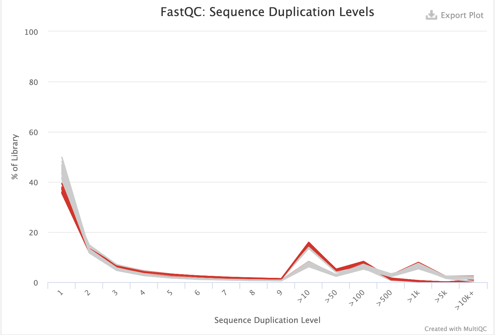
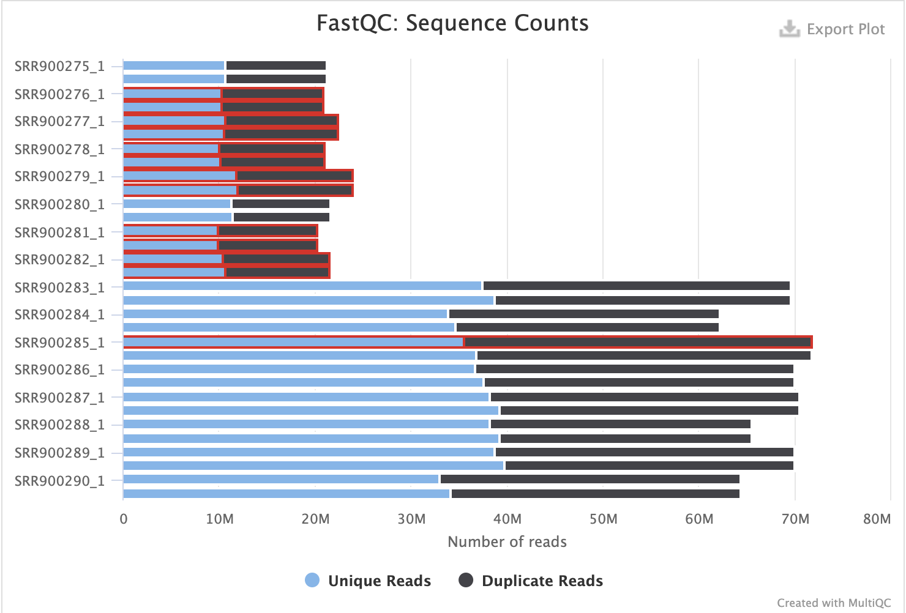
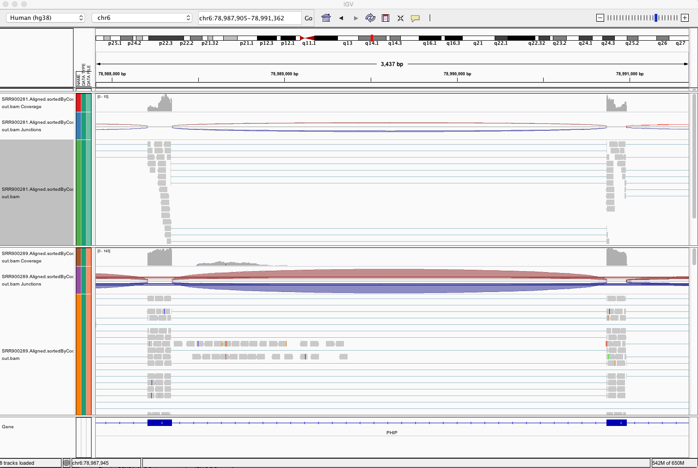

```{r setup, include=FALSE}
knitr::opts_chunk$set(echo = TRUE)
library(tidyverse)
library(data.table)
library(DESeq2)
```

```{r}
meta <- read.delim("SraRunTable.txt", sep = ",", header = T)
srr_acc <- read.delim("SRR_Acc_List.txt", header = F)
drop_repinfo <- meta[apply(meta, 2, function(x) length(unique(x)) != 1)]
drop_repinfo$source <- c("DHF168", "BSO19B", "BSO28", "BSO29", "BSO30", "BSO32N", "BSO36", "BSO37",
                         "DHF168", "BSO19B", "BSO28", "BSO29", "BSO30", "BSO32N", "BSO36", "BSO37")
drop_repinfo %>%
  select(Run, involution, rna_preparation, source) -> meta
```

The vast majority of RNA-seq data are analyzed without duplicate removal. Duplicate removal is not possible for single-read data (without UMIs). De-duplification is more likely to cause harm to the analysis than to provide benefits even for paired-end data (Parekh et al.  2016; below).  This is because the use of simple sequence comparisons or the typical use of alignment coordinates to identify “duplicated reads” will lead to the removal of valid biological duplicates.  RNA-seq library preparation involves several processing steps (e.g. fragmentation, random priming, A-tailing, ligation); none of these processes is truly random or unbiased.  Thus, the occurrence of “duplicated reads” in between millions of reads can be expected even in paired-end read data. Short transcripts and very highly expressed transcripts will show the majority of such “natural” duplicates. Their removal would distort the data.  For example plant RNA-seq data often seem to contain large amounts of duplicated reads. This is in part due to the fact the gene expression in many plant tissues, like leaves, is dominated by a small number of transcripts; much more so than in most animal samples. Another concern is that the fraction of reads identified as “duplicated” is correlated to the number of aligned reads. Thus, one would have to normalize any data set for equal read numbers to avoid introducing additional bias.   
source: https://dnatech.genomecenter.ucdavis.edu/faqs/should-i-remove-pcr-duplicates-from-my-rna-seq-data/  
 
Relative Log Expression (RLE): Similar to TMM, this normalization method is based on the hypothesis that the most genes are not DE. For a given sample, the RLE scaling factor is calculated as the median of the ratio, for each gene, of its read counts over its geometric mean across all samples. By assuming most genes are not DE, the median of the ratio for a given sample is used as a correction factor to all read counts to fulfill this hypothesis [34]. This normalization method is included in the DESeq and DESeq2 Bioconductor packages [34,35].  


1. two library experiment have different depth
2. proper normalization method, since it's know that two method map align different amount of genes 

Appendex: 

###Record:  
Genome:  
http://hgdownload.soe.ucsc.edu/goldenPath/hg38/bigZips/hg38.2bit  
Annotation:  
http://hgdownload.soe.ucsc.edu/goldenPath/hg38/bigZips/genes/  
hg38.refGene.gtf.gz        10-Jan-2020 09:33   23M  
hg38.trf.bed.gz - Tandem Repeats Finder locations, filtered to keep repeats
    with period less than or equal to 12, and translated into UCSC's BED
    format.
genomeGenerate: --sjdbOverhang 99  
alignReads: --alignIntronMin 20 --alignIntronMax 1000000 --twopassMode Basic  
# ENCODE options default for human  
#About 5.24% of introns are more than 200,000 bp and less than 10% of introns are more than 11,000 bp in length. Also, < 0.01% of the introns are < 20 bp in length   --M.K. Sakharkar et al. / Distributions of Exons and Introns in the Human Genome  

```{r, eval=FALSE}
#!/bin/bash
#SBATCH --nodes=1
#SBATCH --ntasks=1 --cpus-per-task=16
#SBATCH --job-name=qc_bash
#SBATCH --time=7-00:00:00
#SBATCH --mem=50G
#SBATCH --error=/athena/angsd/scratch/jiq4001/error 
spack load fastqc
spack load -r trimgalore
spack load -r py-multiqc

# set current work dir
cwd=/athena/angsd/scratch/jiq4001/Pj

mkdir ${cwd}/QC
mkdir ${cwd}/QC/non_trimed
#mkdir ${cwd}/trimed
#mkdir ${cwd}/QC/trimed
mkdir ${cwd}/multi_qc

input_dir=${cwd}/test
qc_dir=${cwd}/QC/non_trimed
#trim_dir=${cwd}/trimed
#qc_trim_dir=${cwd}/QC_trimed
multi_qc=${cwd}/multi_qc

for file in $(ls ${input_dir} | cut -b -9 | uniq -d)
do
    fastqc ${input_dir}/${file}_1.fastq.gz -o ${qc_dir} -t 16 --extract
    fastqc ${input_dir}/${file}_2.fastq.gz -o ${qc_dir} -t 16 --extract
    
    #trim_galore --illumina --stringency 5 --length 30 --paired -o ${trim_dir} ${input_dir}/${file}_1.fastq.gz ${input_dir}/${file}_2.fastq.gz
    
    #fastqc ${trim_dir}/${file}_1_val_1.fq.gz -o ${qc_trim_dir} -t 16 --extract
    #fastqc ${trim_dir}/${file}_2_val_2.fq.gz -o ${qc_trim_dir} -t 16 --extract
done

cd ${multi_qc}
multiqc ${qc_dir}
```

{width=450px}, 
{width=450px}  

Samples prepared by poly-A protocol showed higher duplication level, which is expected considering the add-in of adapter sequence. Since all samples passed Fastqc, no further trimming is done for downstream analysis. 
```{r, eval=FALSE}
#!/bin/bash
#SBATCH --nodes=1
#SBATCH --ntasks=1 --cpus-per-task=16
#SBATCH --job-name=idx
#SBATCH --time=7-00:00:00
#SBATCH --mem=80G
#SBATCH --error=/athena/angsd/scratch/jiq4001/error
#SBATCH --out=/athena/angsd/scratch/jiq4001/out

spack load star@2.7.0e

cwd=/athena/angsd/scratch/jiq4001/Pj
  
mkdir ${cwd}/Star_align
sample_dir=${cwd}/test
star_align=${cwd}/Star_align

for file in $(ls ${sample_dir} | cut -b -9 | uniq -d)
do
STAR --runMode alignReads \
--runThreadN 16 \
--genomeDir ${cwd}/hg38_STARindex \
--readFilesIn ${sample_dir}/${file}_1.fastq.gz ${sample_dir}/${file}_2.fastq.gz \
--outFileNamePrefix ${star_align}/${file}. \
--outSAMattributes NH HI AS nM MD \
--twopassMode Basic \
--readFilesCommand zcat \
--outSAMtype BAM SortedByCoordinate
done
```

###alignment QC  
```{r, eval=FALSE}
[jiq4001@farina Star_align]$spack load samtools@1.9%gcc@6.3.0

# index aligned file
[jiq4001@farina Star_align]$ for file in $(ls | egrep ".*.bam"); do  samtools index ${file}; done

#  flagstat aligned file
[jiq4001@farina Star_align]$ for file in $(ls | egrep ".*.bam$"); do samtools flagstat ${file} >> ${file}_flagstat_out; done


#!/bin/bash
#SBATCH --nodes=1
#SBATCH --ntasks=1 --cpus-per-task=16
#SBATCH --job-name=idx
#SBATCH --time=7-00:00:00
#SBATCH --mem=60G
#SBATCH --error=/athena/angsd/scratch/jiq4001/error
#SBATCH --out=/athena/angsd/scratch/jiq4001/out

cwd=/athena/angsd/scratch/jiq4001/Pj

spack load -r py-rseqc

for SAMPLE in $(ls ${cwd}/Star_align | egrep ".*.bam$")
do
read_distribution.py -i ${cwd}/Star_align/${SAMPLE} -r ${cwd}/hg38.trf.bed > ${cwd}/QC_Star_align/${SAMPLE}.read_distribution.out

geneBody_coverage.py -i ${cwd}/Star_align/${SAMPLE} -r ${cwd}/hg38.trf.bed -o ${cwd}/QC_Star_align/${SAMPLE}.geneBody_coverage.out

mismatch_profile.py -i ${cwd}/Star_align/${SAMPLE} -r ${cwd}/hg38.trf.bed -o ${cwd}/QC_Star_align/${SAMPLE}.mismatch_profile.out

done


## run multiqc .....
```

### reads count   
```{r,eval=FALSE}
#SBATCH --ntasks=1 --cpus-per-task=16
#SBATCH --job-name=idx
#SBATCH --time=7-00:00:00
#SBATCH --mem=80G
#SBATCH --error=/athena/angsd/scratch/jiq4001/error
#SBATCH --out=/athena/angsd/scratch/jiq4001/out

spack load subread

#mkdir reads_count
cwd=/athena/angsd/scratch/jiq4001/Pj
sample_dir=${cwd}/Star_align  
out_dir=${cwd}/reads_count


featureCounts -a ${cwd}/hg38.refGene.gtf \
-o ${out_dir}/featCounts_all.txt \
--minOverlap 25 \
-t "exon" \
-g "gene_id" \
--primary \
--tmpDir '/scratchLocal' \
${sample_dir}/*.bam
```
{width=450px}  

```{r}
r_exon <- fread("featCounts_all.txt.summary")
#head(r_exon)

rename <- gsub(".Aligned.sortedByCoord.out.bam$", "", x = colnames(r_exon))
rename <- gsub("/athena/angsd/scratch/jiq4001/Pj/Star_align/", "", x = rename)
colnames(r_exon) <- rename

r_exon %>%
  filter(Status == "Assigned" | Status == "Unassigned_MultiMapping" | Status == "Unassigned_NoFeatures") %>%
  gather(-Status, key = "sample", value = "reads") %>%
  group_by(sample) %>%
  mutate(percent = round(reads/sum(reads)*100, 2)) %>%
  merge.data.frame(meta, by.x = "sample", by.y = "Run", all.x = TRUE) -> r_exon_meata

r_exon_meata %>%
  ggplot()+
  geom_bar(aes(sample, percent, fill = Status), stat = "identity", position = "stack")+
  theme(axis.text.x = element_text(angle = 90, hjust = 1),
        panel.background = element_rect(fill = "white"),
        axis.line = element_line(colour = "black")) -> p1

r_exon_meata %>%
  ggplot()+
  geom_bar(aes(sample, reads, fill = Status), stat = "identity", position = "stack")+
  theme(axis.text.x = element_text(angle = 90, hjust = 1),
        panel.background = element_rect(fill = "white"),
        axis.line = element_line(colour = "black"))-> p2

r_exon_meata %>%
  ggpubr::ggboxplot(x = "Status", y = "percent",
                color = "rna_preparation", add = "jitter", shape = "rna_preparation",
                legend = "bottom")-> p3

#bar plot
ggpubr::ggarrange(p1, p2, common.legend = T, legend = "bottom")
p3


r_exon_meata
```
##qualitive graph size of gene vs methods ?????    

```{r}
# read data table
rc0 <- read.table("featCounts_all.txt", header=TRUE, row.names = NULL)
head(rc0)

# trim extra text from colname
names(rc0) <- gsub("X.athena.angsd.scratch.jiq4001.Pj.Star_align.", "", names(rc0))
names(rc0) <- gsub(".Aligned.sortedByCoord.out.bam", "", names(rc0))
str(rc0)

# generate rowname with GeneId
row.names(rc0) <- make.names(rc0$Geneid, unique = T) 
readcounts <- rc0[ , -c(1:6)]

r_exon_meata %>%
  arrange(rna_preparation, sample) %>%
  select(sample, involution, rna_preparation, source) %>%
  unique() %>%
  merge.data.frame(data.frame(sample = colnames(readcounts)), all.y = T) -> sampleinfo_df

##########
#seperated by library methods
##########

# create condations with colnames from readcount
poly_a <- readcounts[, 1 : 8]
names(poly_a) <- sampleinfo_df$source[1 : 8]
poly_a_info <- DataFrame(condition = sampleinfo_df$involution[sampleinfo_df$rna_preparation == "Illumina PolyA"],
row.names = names(poly_a) )

nugen <- readcounts[, 9 : 16]
names(nugen) <- sampleinfo_df$source[9 : 16]
nugen_info <- DataFrame(condition = sampleinfo_df$involution[sampleinfo_df$rna_preparation == "NuGEN Ovation"],
row.names = names(nugen) )

all <- readcounts
names(all) <- sampleinfo_df$sample
all_info <- DataFrame(involution = sampleinfo_df$involution,
                      librarymethod = sampleinfo_df$rna_preparation,
                      row.names = names(all))


# wrap reads, condation into object
DESeq.poly_a <- DESeqDataSetFromMatrix(countData = poly_a,
colData = poly_a_info,
design = ~ condition)

DESeq.nugen <- DESeqDataSetFromMatrix(countData = nugen,
colData = nugen_info,
design = ~ condition)

DESeq.all <- DESeqDataSetFromMatrix(countData = all,
colData = all_info,
design = ~ involution + librarymethod + librarymethod : involution)

# normalization
DESeq.poly_a <- estimateSizeFactors(DESeq.poly_a) 
log.norm.counts <- log2(counts(DESeq.poly_a, normalized=TRUE) + 1)
assay(DESeq.poly_a, "log.norm.counts") <- log.norm.counts


DESeq.nugen <- estimateSizeFactors(DESeq.nugen)
log.norm.counts <- log2(counts(DESeq.nugen, normalized=TRUE) + 1)
assay(DESeq.nugen, "log.norm.counts") <- log.norm.counts

DESeq.all <- estimateSizeFactors(DESeq.all)
log.norm.counts <- log2(counts(DESeq.all, normalized=TRUE) + 1)
assay(DESeq.all, "log.norm.counts") <- log.norm.counts
```

```{r}
corr_coeff <- cor(assay(DESeq.all, "log.norm.counts"), method = "pearson")
# use cor plot dendrogram
as.dist(1 - corr_coeff) %>% 
  hclust %>%
  plot( ., labels = colnames(corr_coeff),
      main = "Dendrogram of rlog transformed read counts", sub = "")

heatmap(corr_coeff)

```
```{r}
DESeq.poly_a <- DESeq(DESeq.poly_a)
DESeq.poly_a.results <- results(DESeq.poly_a, independentFiltering = TRUE, alpha = 0.05)
summary(DESeq.poly_a.results)
table(DESeq.poly_a.results$padj < 0.05)
hist(DESeq.poly_a.results$padj)
plotMA(DESeq.poly_a.results, alpha = 0.05,
main = "Test: p.adj.value < 0.05", ylim = c(-4,4))
```


```{r}
DESeq.nugen <- DESeq(DESeq.nugen)
nugen.results <- results(DESeq.nugen, independentFiltering = TRUE, alpha = 0.05)
summary(nugen.results)
table(nugen.results$padj < 0.05)
nugen.results@rownames[which(nugen.results$padj < 0.05)]
hist(nugen.results$padj)
plotMA(nugen.results, alpha = 0.05,
main = "Test: p.adj.value < 0.05", ylim = c(-4,4))
```
```{r}

merge.data.frame(data.frame(df_gene = poly_a.results@rownames[which(poly_a.results$padj < 0.05)],
                            pvalue = poly_a.results$log2FoldChange[which(poly_a.results$padj < 0.05)]),
                 data.frame(df_gene = nugen.results@rownames[which(nugen.results$padj < 0.05)],
                            pvalue = nugen.results$log2FoldChange[which(nugen.results$padj < 0.05)]),
                 by = "df_gene", all.x = T) -> df_p
cor(df_p$pvalue.x, df_p$pvalue.y)


merge.data.frame(data.frame(df_gene = poly_a.results@rownames,
                            pvalue = poly_a.results$log2FoldChange),
                 data.frame(df_gene = nugen.results@rownames,
                            pvalue = nugen.results$log2FoldChange),
                 by = "df_gene", all.x = T) %>% drop_na() -> df_p


cor(df_p$pvalue.x, df_p$pvalue.y)
```


Assumptions
DE and non-DE genes behave the same: Technical effects are the same for DE and non-DE genes.

Balanced expression: There is roughly symmetric differential expression across conditions 

###Disscussion:  
8 biological samples, paired for 2 methods of library preparation. For DE analysis, no imformation was given as the sample is paired or not. 

