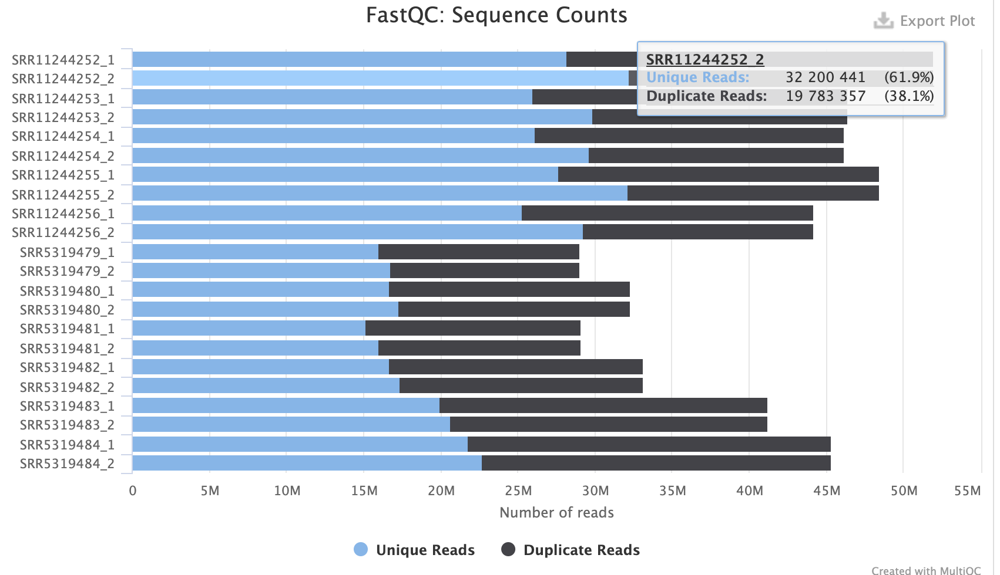
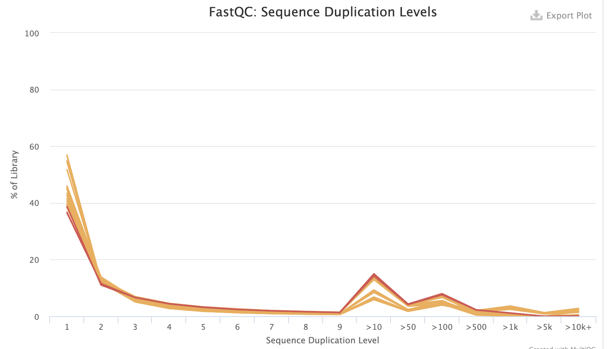
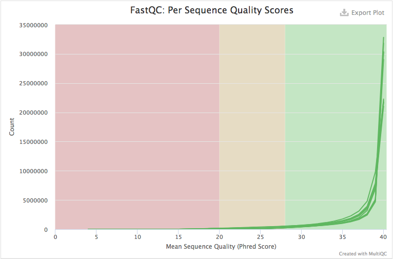
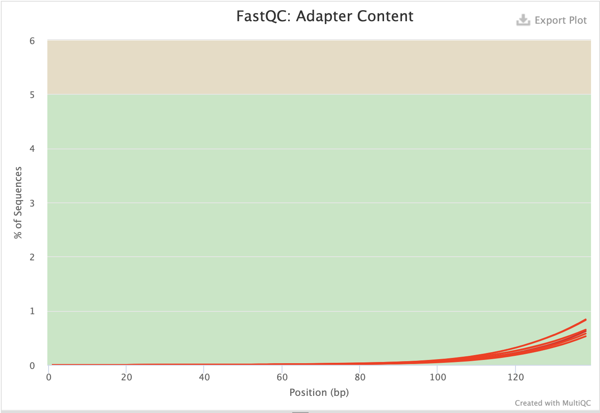
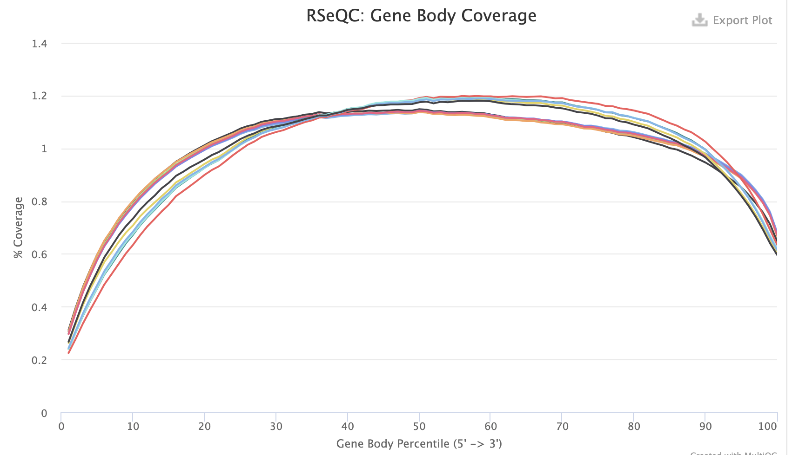
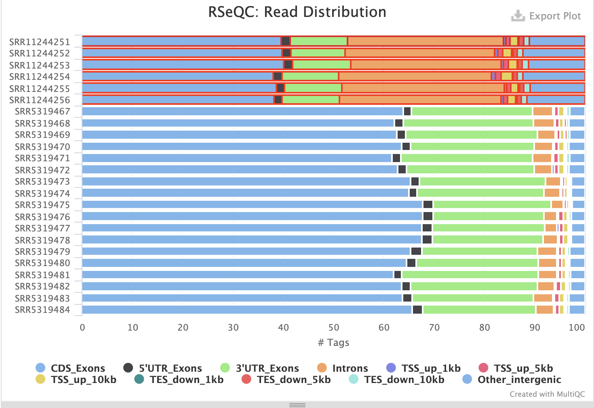

```{r setup, include=FALSE}
knitr::opts_chunk$set(echo = TRUE)
library(tidyverse)
library(data.table)
library(DESeq2)
#BiocManager::install("org.Hs.eg.db")
library("TxDb.Hsapiens.UCSC.hg38.knownGene")
library(goseq)
library(org.Hs.eg.db)
```

```{css, echo=FALSE}
.scroll {
  max-height: 200px;
  overflow-y: auto;
}
```

### Introduction  


### Method  

###Samples and RNA Sequencing  
RNA of A549 cells-infected with Zika virus and un-infected A549 cells was isolated using RNeasy mini kit (QIAGEN, Valencia, CA, USA). RNAseq libraries were constructed using a TruSeq RNA Sample Prep V2 Kit. mRNA profiles was generated by deep sequencing, in triplicate, using Illumina Hiseq4000. All samples passed QC without triming.  

###Sequence Alignment and Gene Level Expression Quantification  
Sequence alignment and quantification of gene and exon level expression was carried out using RNA-seq analytical pipeline see _appendex_. Pair end reads were aligned to the human genome build hg38.refGene using star(2.7.0e), Star alignReads command options: --alignIntronMin 20 --alignIntronMax 1000000 --twopassMode Basic. Subread(1.6.2e) was used to count the reads mapping to individual exons according to hg38.refGene annotations (10-Jan-2020). Gene level expression was normalized by DESeq2(3.10e) Bioconductor packages, using Relative Log Expression (RLE) assuming most genes are not DE, that is calculated as the median of the ratio for each gene of its read counts over its geometric mean across all samples account for sequencing depth and RNA composition of the sample.  


### Result  

```{r, class.output="scroll", echo=F}
r_exon <- fread("data/featCounts_transcript_all.txt.summary.txt")
#head(r_exon)

rename <- gsub(".Aligned.sortedByCoord.out.bam$", "", x = colnames(r_exon))
rename <- gsub("/athena/angsd/scratch/jiq4001/Pj1/Star_align/", "", x = rename)
colnames(r_exon) <- rename


r_exon %>%
  filter(Status %in% c("Assigned", "Unassigned_MultiMapping",
                       "Unassigned_NoFeatures", "Unassigned_Overlapping_Length",
                       "Unassigned_Ambiguity")) %>%
  gather(-Status, key = "sample", value = "reads") %>%
  group_by(sample) %>%
  mutate(percent = round(reads/sum(reads)*100, 2)) -> r_exon_meata

```


```{r, eval=F, echo=F}
#### bar graph alternatime
r_exon_meata %>%
  ggplot()+
  geom_bar(aes(sample, percent, fill = Status), stat = "identity", position = "stack")+
  theme(axis.text.x = element_text(angle = 90, hjust = 1),
        panel.background = element_rect(fill = "white"),
        axis.line = element_line(colour = "black")) -> p1

r_exon_meata %>%
  ggplot()+
  geom_bar(aes(sample, reads, fill = Status), stat = "identity", position = "stack")+
  theme(axis.text.x = element_text(angle = 90, hjust = 1),
        panel.background = element_rect(fill = "white"),
        axis.line = element_line(colour = "black"))-> p2


ggpubr::ggarrange(p1, p2, common.legend = T, legend = "bottom")

```


```{r, class.output="scroll", echo=F, message=F, warning=F}
# read data table
rc0 <- read.table("data/featCounts_transcript_all.txt", header=TRUE, row.names = NULL)


# trim extra text from colname
names(rc0) <- gsub("X.athena.angsd.scratch.jiq4001.Pj1.Star_align.", "", names(rc0))
names(rc0) <- gsub(".Aligned.sortedByCoord.out.bam", "", names(rc0))

# generate rowname with GeneId
row.names(rc0) <- make.names(rc0$Geneid, unique = T) 
readcounts <- rc0[ , -c(1:6)]


all <- readcounts
namedf <- outer(c("Ctrl", "Infected"), c("Rep1", "Rep2", "Rep3"), paste)
names(all) <- c(namedf[1,], namedf[2,])
all_info <- DataFrame(condition = rep(c("Ctrl", "Infected"), each = 3),
                      row.names = names(all))


# wrap reads, condation into object

DESeq.all <- DESeqDataSetFromMatrix(countData = all, colData = all_info, design = ~ condition)

# normalization
DESeq.all <- estimateSizeFactors(DESeq.all)
log.norm.counts <- log2(counts(DESeq.all, normalized=TRUE) + 1)
assay(DESeq.all, "log.norm.counts") <- log.norm.counts

```
`

To investigate the differencially expressed genes, multiple testing on normalized reads count at 0.05 significent level with each gene using glm with contrast model ~ condition(condition_Infected_vs_Ctrl).   

```{r, echo=F, message=F, warning=F}
DESeq.all <- DESeq(DESeq.all)
resultsNames(DESeq.all)
DESeq.all.result <- results(DESeq.all, independentFiltering = TRUE, alpha = 0.05,
                             name = "condition_Infected_vs_Ctrl")
plotDispEsts(DESeq.all)
```

Dispersion plot converge overall.  6258, 29% genes are excluded from multiple testing. the mean read counts(normalized) of 1265 out of 21856 genes are different in the infected group than control gorup with adjusted p-value < 0.05.     

```{r, echo=F, message=F, warning=F}
summary(DESeq.all.result)
table(DESeq.all.result$padj < 0.05)
#hist(DESeq.all.result$padj)

#plotMA(DESeq.all.result, alpha = 0.05, main = "Test: p.adj.value < 0.05", ylim = c(-8,8))
```
Mean of Normalized Counts vs Log Fold Change is plotted for genes with adjusted p-value < 0.05. Genes with more than 2 fold log change is colored in red.  

```{r, echo=F, message=F}
DESeq.all.result.sorted <- DESeq.all.result[order(DESeq.all.result$padj), ] %>% head(n = 1265) %>% data.frame()

### plot of DE genes aj-pvalue < 0.05
plot(log(DESeq.all.result.sorted$baseMean), DESeq.all.result.sorted$log2FoldChange, 
     col = ifelse(abs(DESeq.all.result.sorted$log2FoldChange) >= 2, "red", "black"),
     xaxt="n", xlab = "Mean of Normalized Counts", ylab = "Log Fold Change")
axis(1, at = c(1, 2, 5, 10), labels = c("1e+1", "1e+02", "1e+05", "1e+10"))
abline(h = 0, col = "red")

```

Heatmap of mean of Normalized Counts is plotted for genes with adjusted p-value < 0.05.     
```{r, echo=F}
DE_gene <- DESeq.all@assays@data$log.norm.counts[rownames(DESeq.all.result.sorted),]
pheatmap::pheatmap(DE_gene, scale = "row", show_rownames = F)
```

To explore the impact of Zika infection DE genes and their functional characteristics, Gene Ontology Term Enrichment Analysis is performed.  

```{r, echo=F, message=F, warning=F}
gene.vector <- ifelse(DESeq.all.result$padj < 0.05 & DESeq.all.result$log2FoldChange < 2, 1, 0)
#sum(gene.vector, na.rm = T)
names(gene.vector) <- rownames(DESeq.all.result)
gene.vector <- ifelse(is.na(gene.vector), 0, gene.vector)

#glen <- rc0$Length
glen <- getlength(rownames(DESeq.all.result), "hg38","geneSymbol")
#sum(gene.vector)
#length(glen)
#length(gene.vector)
gid <- rownames(rc0)
pwf <- nullp(gene.vector, id = gid, bias.data = glen)
go.wall <- goseq(pwf,"hg38","geneSymbol", use_genes_without_cat=T)
#go.gns <- getgo(rownames(DESeq.all.result), "hg38", "geneSymbol")%>%stack()
go.wall %>%
  filter(over_represented_pvalue <= 0.05 | under_represented_pvalue <= 0.05)-> go.wall
#write_csv(go.wall, "go.wall.csv")
source("revigo_r/REVIGO_treemap.r")  

```

```{r define_own_treemap_function, echo=F}
REVIGO_treemap <- function(revigo.data, col_palette = "Paired",
                           title = "REVIGO Gene Ontology treemap", ...){
  stuff <- data.frame(revigo.data)
  names(stuff) <- c("term_ID","description","freqInDbPercent","abslog10pvalue",
                    "uniqueness","dispensability","representative")
  stuff$abslog10pvalue <- as.numeric( as.character(stuff$abslog10pvalue) )
  stuff$freqInDbPercent <- as.numeric( as.character(stuff$freqInDbPercent) )
  stuff$uniqueness <- as.numeric( as.character(stuff$uniqueness) )
  stuff$dispensability <- as.numeric( as.character(stuff$dispensability) )
  # check the treemap command documentation for all possible parameters - 
  # there are a lot more
  treemap::treemap(
    stuff,
    index = c("representative","description"),
    vSize = "abslog10pvalue",
    type = "categorical",
    vColor = "representative",
    title = title,
    inflate.labels = FALSE,      
    lowerbound.cex.labels = 0,   
    bg.labels = 255,
    position.legend = "none",
    fontsize.title = 22, fontsize.labels=c(18,12,8),
    palette= col_palette, ...
  )
}
REVIGO_treemap(stuff)
```


###Appendex:  
  
###where did you get it from?   
Next Generation Sequencing Facilitates Quantitative Analysis of A549 Control and A549 infected with Zika virus Transcriptomes (human)  
https://www.ncbi.nlm.nih.gov/bioproject/PRJNA610552  
  
###what publication is it linked to?   
https://www.ncbi.nlm.nih.gov/pmc/articles/PMC6266559/  
Human Fetal Astrocytes Infected with Zika Virus Exhibit Delayed Apoptosis and Resistance to Interferon: Implications for Persistence. Daniel Limonta,1,† Juan Jovel,2,† Anil Kumar, et al.  

###who generated the data?  
Institute of Blood Transfusion, Chinese Academy of Medical Sciences and Peking Union Medical College  
  
###how was the RNA extracted?  
RNeasy mini kit (QIAGEN, Valencia, CA, USA)   
  
###what library prep was used?  
TruSeq RNA Sample Prep V2 Kit  Illumina   
  
###what cell type was used?  
HFAs cultures between 5–7 passages were employed. A549 (human lung carcinoma)   

###what was the treatment/experimental condition?   
A549(human lung carcinoma) cells-infected with Zika virus for 28 days and aun-infected A549 cells      

###what sequencing platform was used?  
Illumina Hiseq4000   
  

###Record:   
Genome:  
http://hgdownload.soe.ucsc.edu/goldenPath/hg38/bigZips/hg38.2bit  
Annotation:  
http://hgdownload.soe.ucsc.edu/goldenPath/hg38/bigZips/genes/  
hg38.refGene.gtf.gz        10-Jan-2020 09:33   23M  
hg38.trf.bed.gz - Tandem Repeats Finder locations, filtered to keep repeats
    with period less than or equal to 12, and translated into UCSC's BED
    format.
genomeGenerate: --sjdbOverhang 99  
alignReads: --alignIntronMin 20 --alignIntronMax 1000000 --twopassMode Basic  
ENCODE options default for human  
About 5.24% of introns are more than 200,000 bp and less than 10% of introns are more than 11,000 bp in length. Also, < 0.01% of the introns are < 20 bp in length   --M.K. Sakharkar et al. / Distributions of Exons and Introns in the Human Genome  

```{r, eval=FALSE, class.output="scroll"}
#!/bin/bash
#SBATCH --nodes=1
#SBATCH --ntasks=1 --cpus-per-task=16
#SBATCH --job-name=qc_bash
#SBATCH --time=7-00:00:00
#SBATCH --mem=50G
#SBATCH --error=/athena/angsd/scratch/jiq4001/error 
spack load fastqc
spack load -r trimgalore
spack load -r py-multiqc

# set current work dir
cwd=/athena/angsd/scratch/jiq4001/Pj

mkdir ${cwd}/QC
mkdir ${cwd}/QC/non_trimed
#mkdir ${cwd}/trimed
#mkdir ${cwd}/QC/trimed
mkdir ${cwd}/multi_qc

input_dir=${cwd}/test
qc_dir=${cwd}/QC/non_trimed
#trim_dir=${cwd}/trimed
#qc_trim_dir=${cwd}/QC_trimed
multi_qc=${cwd}/multi_qc

for file in $(ls ${input_dir} | cut -b -9 | uniq -d)
do
    fastqc ${input_dir}/${file}_1.fastq.gz -o ${qc_dir} -t 16 --extract
    fastqc ${input_dir}/${file}_2.fastq.gz -o ${qc_dir} -t 16 --extract
    
    #trim_galore --illumina --stringency 5 --length 30 --paired -o ${trim_dir} ${input_dir}/${file}_1.fastq.gz ${input_dir}/${file}_2.fastq.gz
    
    #fastqc ${trim_dir}/${file}_1_val_1.fq.gz -o ${qc_trim_dir} -t 16 --extract
    #fastqc ${trim_dir}/${file}_2_val_2.fq.gz -o ${qc_trim_dir} -t 16 --extract
done

cd ${multi_qc}
multiqc ${qc_dir}
```

{width=400px}, 
{width=400px}  
{width=400px}
{width=400px}    
  
Samples prepared by poly-A protocol showed higher duplication level, which is expected considering the add-in of adapter sequence. Since all samples passed Fastqc, no further trimming is done for downstream analysis. 
```{r, eval=FALSE, class.output="scroll"}
#!/bin/bash
#SBATCH --nodes=1
#SBATCH --ntasks=1 --cpus-per-task=16
#SBATCH --job-name=idx
#SBATCH --time=7-00:00:00
#SBATCH --mem=80G
#SBATCH --error=/athena/angsd/scratch/jiq4001/error
#SBATCH --out=/athena/angsd/scratch/jiq4001/out

spack load star@2.7.0e

cwd=/athena/angsd/scratch/jiq4001/Pj
  
mkdir ${cwd}/Star_align
sample_dir=${cwd}/test
star_align=${cwd}/Star_align

for file in $(ls ${sample_dir} | cut -b -9 | uniq -d)
do
STAR --runMode alignReads \
--runThreadN 16 \
--genomeDir ${cwd}/hg38_STARindex \
--readFilesIn ${sample_dir}/${file}_1.fastq.gz ${sample_dir}/${file}_2.fastq.gz \
--outFileNamePrefix ${star_align}/${file}. \
--outSAMattributes NH HI AS nM MD \
--twopassMode Basic \
--readFilesCommand zcat \
--outSAMtype BAM SortedByCoordinate
done
```

Alignment QC  
```{r, eval=FALSE, class.output="scroll"}
[jiq4001@farina Star_align]$spack load samtools@1.9%gcc@6.3.0

# index aligned file
[jiq4001@farina Star_align]$ for file in $(ls | egrep ".*.bam"); do  samtools index ${file}; done

#  flagstat aligned file
[jiq4001@farina Star_align]$ for file in $(ls | egrep ".*.bam$"); do samtools flagstat ${file} >> ${file}_flagstat_out; done

#!/bin/bash
#SBATCH --nodes=1
#SBATCH --ntasks=1 --cpus-per-task=16
#SBATCH --job-name=idx
#SBATCH --time=7-00:00:00
#SBATCH --mem=60G
#SBATCH --error=/athena/angsd/scratch/jiq4001/error
#SBATCH --out=/athena/angsd/scratch/jiq4001/out

cwd=/athena/angsd/scratch/jiq4001/Pj

spack load -r py-rseqc

for SAMPLE in $(ls ${cwd}/Star_align | egrep ".*.bam$")
do
read_distribution.py -i ${cwd}/Star_align/${SAMPLE} -r ${cwd}/hg38.trf.bed > ${cwd}/QC_Star_align/${SAMPLE}.read_distribution.out

geneBody_coverage.py -i ${cwd}/Star_align/${SAMPLE} -r ${cwd}/hg38.trf.bed -o ${cwd}/QC_Star_align/${SAMPLE}.geneBody_coverage.out

mismatch_profile.py -i ${cwd}/Star_align/${SAMPLE} -r ${cwd}/hg38.trf.bed -o ${cwd}/QC_Star_align/${SAMPLE}.mismatch_profile.out

done

## run multiqc .....
```

*Figure1. Gene Body Coverage*  
{width=400px}
{width=400px}  

It appears both sequencing experiments with either library preparation methods are not able to get ideal sufficient coverage at 5'end, though the aim was not to identify low expression genes.  

Reads count   
```{r,eval=FALSE, class.output="scroll"}
#SBATCH --ntasks=1 --cpus-per-task=16
#SBATCH --job-name=idx
#SBATCH --time=7-00:00:00
#SBATCH --mem=80G
#SBATCH --error=/athena/angsd/scratch/jiq4001/error
#SBATCH --out=/athena/angsd/scratch/jiq4001/out

spack load subread

#mkdir reads_count
cwd=/athena/angsd/scratch/jiq4001/Pj
sample_dir=${cwd}/Star_align  
out_dir=${cwd}/reads_count


featureCounts -a ${cwd}/hg38.refGene.gtf \
-o ${out_dir}/featCounts_all.txt \
--minOverlap 25 \
-t "exon" \
-g "gene_id" \
--primary \
--tmpDir '/scratchLocal' \
${sample_dir}/*.bam
```


