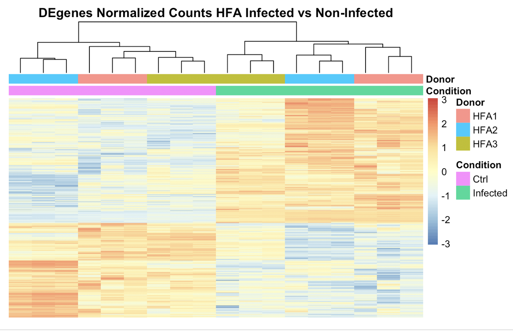
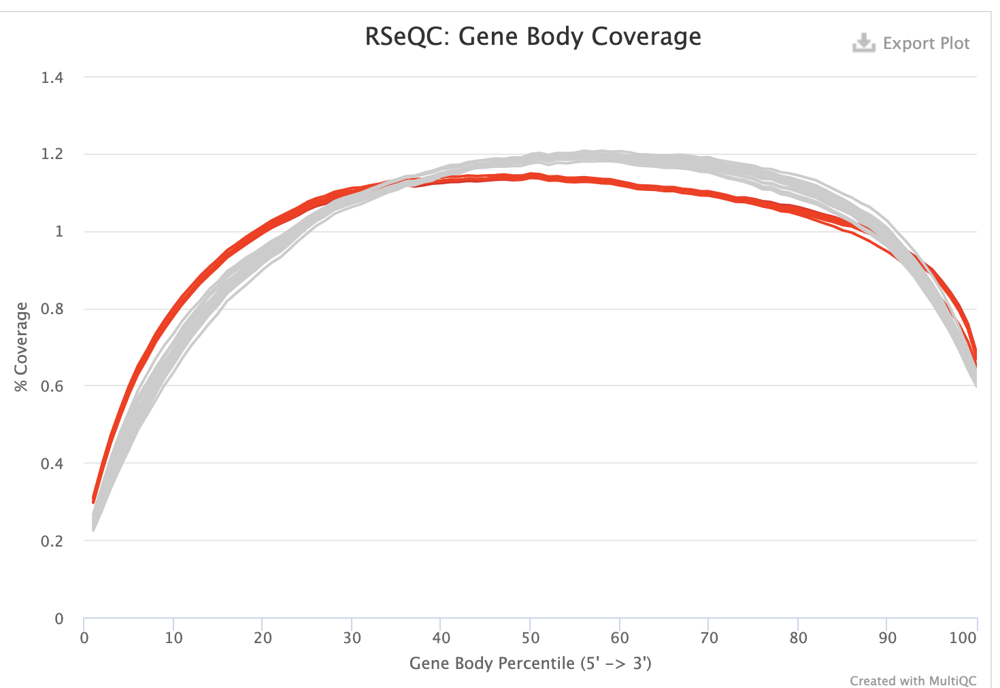

```{r setup, include=FALSE}
knitr::opts_chunk$set(echo = TRUE)
library(tidyverse)
library(data.table)
library(DESeq2)
#BiocManager::install("org.Hs.eg.db")
library("TxDb.Hsapiens.UCSC.hg38.knownGene")
library(biomaRt)
library(goseq)
library(org.Hs.eg.db)
```

```{css, echo=FALSE}
.scroll {
  max-height: 200px;
  overflow-y: auto;
}
```

Source paper: Human Fetal Astrocytes Infected with Zika Virus Exhibit Delayed Apoptosis and Resistance to Interferon: Implications for Persistence. *Daniel Limonta, Juan Jovel, Anil Kumar, et al.* Viruses 2018, 10, 646.     

###Project Goal    

Perform bioinformatic analysis to compare with the result with the origional paper's result that in HFA samples    
1, deregulation of genes affect morphogenesis, cell-substrate adherens junction assembly and focal adhesion assembly;     
2, top upregulated genes identified are related with antiviral defense;     
3, to find if theres gene level eveidence that support experiment observation of moderate apoptosis and inefficient antiviral response in HFA compared to control A549.    

### Introduction  

Zika virus (ZIKV) is an arthropod-borne virus (transmitted by Arthropod) of the genus Flavivirus(with positive sense ssRNA,  10–11kb in length). The recent ZIKV pandemic in the Western Hemisphere was associated with a dramatic increase in microcephaly and other neurological deficits in the fetuses. Viral kinetics study shown that in general, the half-life of infected host cell is less than 10 hours.[1] Previous in-vitro study on human fetal neural progenitors (hNPs) had shown that ZIKV replication persists in hNPs for at least 28 days[2].  hNPs can be differentiated into neurons, oligodendrocytes, or astrocytes. Human fetal astrocytes (HFAs) is the most abundant cell type in the central nervous system, they may function widely as composing the BBB, provision of nutrients to the neurons, maintenance of extracellular ion balance, and damage repair.[3] The researcher of this paper speculated that HFAs possibly functioned as viral reservoirs (cell types or anatomical sites which shown more stable kinetic properties in persistence with replication-competent forms of the virus  than the main pool of actively replicating virus), that may contribute to the establishment of chronic brain infection and neurodevelopmental abnormalities.    

TIM/TAM receptor titer/blockage followed by ZIKV rt-PCR was used to prove that HFAs is permissive to ZIKV infection. Flow cytometry viability assay was used to prove that HFAs showed lower level of apoptosis in persistent infection comparing to A549. rt-PCR of ZIKV genome showed that the virus genome is relatively stable that adaptive mutations were not required for establishing chronic infection.     
Total RNAseq analyses of persistently infected cells was used to show that ZIKV alters host gene expression in a manner that could affect developmental processes. _Quote from paper:_ [Persistent ZIKV Infection Has A Dramatic Effect on HFA Transcription, the average increase in expression level was 49-fold. Most of the genes that were deregulated by viral infection (|fold change| > 2; FDR < 0.05) were upregulated (Figure 5A,B). In total, 722 transcripts were upregulated, while 81 transcripts were downregulated (Table S2) by chronic ZIKV infection. In persistently infected cells, extensive deregulation of genes that affect morphogenesis of epithelium, cell-substrate adherens junction assembly and focal adhesion assembly were observed (Table S2). The clueGO analysis of upregulated genes identified 10 top terms exclusively related with antiviral defense for persistently infected cells. _Paper Conclusion:_ ZIKV in the fetal brain and that moderate apoptosis combined with inefficient antiviral response from these cells may contribute to the establishment of chronic brain infection associated with the ZIKV neurodevelopmental abnormalities. *control A549 RNA Seq analysis was not reported in the paper]    

### Method   
###Samples 
HFAs were obtained from 15 to 19-week aborted fetuses with written consent.    
Positive Control: continuous human cell lines A549 cells overexpress AXL with high permissive property.    
(HFAs were highly permissive to ZIKV infection, it is shown to be TIM/TAM receptor member AXL dependent.[4], A549 overexpress AXL, depending upon the donor, only 23–46% of HFAs exhibited detectable levels of this protein)   

###RNA Sequencing  
Total RNA of A549 cells-infected with Zika virus and un-infected A549 cells was isolated using RNeasy mini kit (QIAGEN, Valencia, CA, USA).     
RNAseq libraries were constructed using a TruSeq RNA Sample Prep V2 Kit.     
mRNA profiles were generated by deep sequencing, in triplicate, using Illumina Hiseq4000. All samples passed QC without trimming.   

###Sequence Alignment and Gene Level Expression Quantification    
Sequence alignment and quantification of gene and exon level expression was carried out using RNA-seq analysis pipeline (see _appendex_ and _script folder with README_). Paired-end reads were aligned to the human ensemble genome GRCh38.99 using star (2.7.0e), Star alignReads command options: --alignIntronMin 20 --alignIntronMax 1000000 --twopassMode Basic. Subread (1.6.2e) was used to count the reads mapping to individual exons according to hg38.refGene annotations (10-Jan-2020). DESeq2 (3.10e) Bioconductor packages, is used to normalize gene read counts and gene differencial expression. DEXSeq (1.32.0) Bioconductor package, is used to normalize exon read counts and transcriptomic differential expression.    

### Result  
_Table1._ Summary of average aligned reads count and average aligned reads percentage     
```{r, class.output="scroll", echo=F, warning=F, message=F}
r_exon <- fread("data/featCounts_transcript_all.txt.summary.txt")
#rename <- gsub(".Aligned.sortedByCoord.out.bam$", "", x = colnames(r_exon))
#rename <- gsub("/athena/angsd/scratch/jiq4001/Pj1/Star_align/", "", x = rename)
#colnames(r_exon) <- rename
tname <- outer(c("infected", "ctrl"), c("rep1", "rep2", "rep3"), paste)
tname <- outer(c("A549", "HFA1", "HFA2", "HFA3"), c(tname[1,], tname[2,]), paste)
colnames(r_exon) <- c("Status", tname[1, ], tname[2, ], tname[3, ], tname[4, ])
r_exon %>%
  filter(Status %in% c("Assigned", "Unassigned_MultiMapping",
                       "Unassigned_NoFeatures", "Unassigned_Overlapping_Length",
                       "Unassigned_Ambiguity")) %>%
  gather(-Status, key = "sample", value = "reads") %>%
  group_by(sample) %>%
  mutate(percent = round(reads/sum(reads)*100, 2)) -> r_exon_meata

r_exon_meata %>%
  separate(sample, into = c("condition", "rep"))%>%
  mutate(condition  = c(rep("A549", 30), rep("HFA", 90)))%>%
  group_by(Status, condition) %>%
  summarise(average_aligned_readcount = mean(reads)%>%round(0),
            average_aligned_percentage = mean(percent)%>%round(2),
            sd_rc = sd(reads)%>%round(0),
            sd_pc = sd(percent)%>%round(2)) -> rc_plot#
rc_plot%>%
  mutate(count = paste0(average_aligned_readcount, "+/-", sd_rc),
            percentage = paste0(average_aligned_percentage, "+/-", sd_pc))%>%
  dplyr::select(Status, condition, count)%>%
  spread(key = "condition", value = "count") ->c1
rc_plot%>%
  mutate(count = paste0(average_aligned_readcount, "+/-", sd_rc),
            percentage = paste0(average_aligned_percentage, "+/-", sd_pc))%>%
  dplyr::select(Status, condition, percentage)%>%
  spread(key = "condition", value = "percentage") ->c2
tb1 <- cbind.data.frame(c1, c2[, 2:3])  
colnames(tb1) <- c("Mapping_Status", "A549_Count", "HFA_Count", "A549_Percengate", "HFA_Percengate")
kableExtra::kable(tb1)%>%
  kableExtra::kable_styling()
```

Total RNA seq analysis includes 6 HFA samples from 3 donors and 2 A549 control samples, paired in condition (ZIKV infected vs none-infected), with 3 bio-replicate each. The average mapped reads count and average mapped reads percentage of the 6 samples are summarized in _Table.1_, and plot was shown _Figure.1_.     

```{r, echo=F, warning=F, message=F, fig.align="center"}
##### bar graph alternatime
#r_exon_meata %>%
#  ggplot()+
#  geom_bar(aes(sample, percent, fill = Status), stat = "identity", position = "stack")+
#  theme(axis.text.x = element_text(angle = 90, hjust = 1),
#        panel.background = element_rect(fill = "white"),
#        axis.line = element_line(colour = "black")) -> p1
#
#r_exon_meata %>%
#  ggplot()+
#  geom_bar(aes(sample, reads, fill = Status), stat = "identity", position = "stack")+
#  theme(axis.text.x = element_text(angle = 90, hjust = 1),
#        panel.background = element_rect(fill = "white"),
#        axis.line = element_line(colour = "black"))-> p2

rc_plot%>%
  ggplot(aes(Status, average_aligned_readcount, fill = condition))+
  geom_bar(stat="identity", position=position_dodge())+
  geom_errorbar(aes(ymin=average_aligned_readcount-sd_rc, ymax=average_aligned_readcount+sd_rc), width=.2,
                 position=position_dodge(.9))+
  theme(axis.text.x = element_text(angle = 60, hjust = 1),
        panel.background = element_rect(fill = "white"),
        axis.line = element_line(colour = "black")) -> p1

rc_plot%>%
  ggplot(aes(Status, average_aligned_percentage, fill = condition))+
  geom_bar(stat="identity", position=position_dodge())+
  geom_errorbar(aes(ymin=average_aligned_percentage-sd_pc, ymax=average_aligned_percentage+sd_pc), width=.2,
                 position=position_dodge(.9))+
  theme(axis.text.x = element_text(angle = 60, hjust = 1),
        panel.background = element_rect(fill = "white"),
        axis.line = element_line(colour = "black")) -> p2
  
  
ggpubr::ggarrange(p1, p2, common.legend = T, legend = "bottom")


```
  
_Figure1._ Summary of average aligned reads count and average aligned reads percentage      

```{r, class.output="scroll", echo=F, message=F, warning=F}
# read data table
rc0 <- read.table("data/featCounts_transcript_all.txt", header=TRUE, row.names = NULL)
#rc1 <- read.table("temp/featCounts_transcript_all_3.txt", header=TRUE, row.names = NULL)
#rc1 <- cbind(rc0, rc1[, 7:12])
#write.table(rc1, file = "data/featCounts_transcript_all.txt",row.names = F)

# trim extra text from colname
names(rc0) <- gsub("X.athena.angsd.scratch.jiq4001.Pj1.Star_align.", "", names(rc0))
names(rc0) <- gsub(".Aligned.sortedByCoord.out.bam", "", names(rc0))

# generate rowname with GeneId
row.names(rc0) <- make.names(rc0$Geneid, unique = T) 
readcounts <- rc0[ , -c(1:6)]


all <- readcounts
namedf <- c("Status", tname[1, c(4:6, 1:3)], tname[2, ], tname[3, ], tname[4, ])
names(all) <- namedf[-1]
all_info <- DataFrame(condition = c(rep(c("ctrl", "infected"), each = 3), rep(rep(c("infected", "ctrl"), each = 3), 3)),
                      sample = rep(c("A549", "HFA1", "HFA2", "HFA3"), each = 6),
                      type = c(rep("ctrl", 6), rep("HFA", 18)),
                      row.names = names(all))


# wrap reads, condation into object

DESeq.all <- DESeqDataSetFromMatrix(countData = all, colData = all_info, design = ~ condition + type +  condition:type)
DESeq.HFA <- DESeq.all[, c(7:24)]
DESeq.a <- DESeq.all[, c(1:6)]
DESeq.HFA@design <- DESeq.a@design <- ~condition

# normalization
DESeq.all <- estimateSizeFactors(DESeq.all)
log.norm.counts <- log2(counts(DESeq.all, normalized=TRUE) + 1)
assay(DESeq.all, "log.norm.counts") <- log.norm.counts


DESeq.HFA <- estimateSizeFactors(DESeq.HFA)
log.norm.counts <- log2(counts(DESeq.HFA, normalized=TRUE) + 1)
assay(DESeq.HFA, "log.norm.counts") <- log.norm.counts

DESeq.a <- estimateSizeFactors(DESeq.a)
log.norm.counts <- log2(counts(DESeq.a, normalized=TRUE) + 1)
assay(DESeq.a, "log.norm.counts") <- log.norm.counts

```
   
Reads counts are normalized on per gene/sample bases with Deseq2 R package, followed by differential expression analysis using GLM with NB distribution model. To investigate the differentially expression of genes induced by KIKV infection, multiple testing on normalized reads count at 0.05 significance level with each gene using glm with contrast $model = condition(Infected_{vs}Ctrl)$ in the subset of HFA samples. To investigate whether HFA response differently than the Control A549 cell in response to KIKV infection, the global differentially analysis is checked using $model =  sample + condition + condition:sample$ on the full reads counts dataset including HFA and A549.    

```{r, echo=F, message=F, warning=F}
DESeq.all <- DESeq(DESeq.all)
DESeq.HFA <- DESeq(DESeq.HFA)
DESeq.a <- DESeq(DESeq.a)
#resultsNames(DESeq.all)
#resultsNames(DESeq.HFA)
DESeq.all.result <- results(DESeq.all, independentFiltering = TRUE, alpha = 0.05,
                             name = "conditioninfected.typeHFA")

DESeq.all.result_HFA <- results(DESeq.HFA, independentFiltering = TRUE, alpha = 0.05,
                             name = "condition_infected_vs_ctrl")
#sum(row.names(DESeq.all.result_HFA) == "ENSG00000137166")
#DESeq.all.result_HFA[row.names(DESeq.all.result_HFA) == "ENSG00000137166",]
DESeq.all.result_a <- results(DESeq.a, independentFiltering = TRUE, alpha = 0.05,
                             name = "condition_infected_vs_ctrl")
#plotDispEsts(DESeq.all)
#plotDispEsts(DESeq.HFA)
#plotDispEsts(DESeq.a)
```
       
  
```{r, echo=F, message=F, warning=F, eval=F}
summary(DESeq.all.result)
summary(DESeq.all.result_HFA)
summary(DESeq.all.result_a)

table(DESeq.all.result$padj < 0.05)
table(DESeq.all.result_HFA$padj < 0.05)

hist(DESeq.all.result$padj)
plotMA(DESeq.all.result, alpha = 0.05, main = "Test: p.adj.value < 0.05", ylim = c(-8,8))
```

```{r, echo=F, message=F}

DESeq.FHA.result.sorted <- DESeq.all.result_HFA[order(DESeq.all.result_HFA$padj), ]%>% head(table(DESeq.all.result_HFA$padj < 0.05)[2])
#sum(row.names(DESeq.FHA.result.sorted) == "ENSG00000137166")
#table(DESeq.FHA.result.sorted$log2FoldChange <=-2)
DE_gene.HFA <- DESeq.HFA@assays@data$log.norm.counts[rownames(DESeq.FHA.result.sorted),]
#colnames(DE_gene.HFA)
rowname_df <- data.frame(Condition = factor(rep(rep(c("Infected", "Ctrl"), each = 3), 3)), 
                         #BioRep = factor(rep(rep(c("Rep1", "Rep2", "Rep3"), 2), 3)),
                         Donor = factor(rep(c("HFA1", "HFA2", "HFA3"), each = 6)))
rownames(rowname_df) <- colnames(DE_gene.HFA)
#pheatmap::pheatmap(DE_gene.HFA, scale = "row", annotation_col = rowname_df, show_rownames = F, treeheight_row = 0, show_colnames = F, main = "DEgenes Normalized Counts HFA Infected vs Non-Infected")->h1

DESeq.all.result.sorted <- DESeq.all.result[order(DESeq.all.result$padj), ]%>% head(table(DESeq.all.result$padj < 0.05)[2])

```

```{r, eval=F, echo=F}
DE_gene.all <- DESeq.all@assays@data$log.norm.counts[rownames(DESeq.all.result.sorted),]
#colnames(DE_gene.HFA)
rowname_df <- data.frame(Condition = factor(c(rep(c("ctrl", "infected"), each = 3), rep(rep(c("infected", "ctrl"), each = 3), 3))), 
                         Type = factor(c(rep("A549", 6), rep("HFA", 18)))#,
                         #Donor = factor(rep(c("A549", "HFA1", "HFA2", "HFA3"), each = 6))
                         )
rownames(rowname_df) <- colnames(DE_gene.all)
#pheatmap::pheatmap(DE_gene.all, scale = "row", annotation_col = rowname_df, show_rownames = F, treeheight_row = 0, show_colnames = F, main = "DEgenes Normalized Counts Infected-A549 vs Infected-HFA")->h2

```

{width=450px}
{width=450px}  
_Figure.2_. Heatmap of mean of Normalized Counts of DEgenes with adjusted p-value < 0.05.    
    
Heatmap of the mean normalized Counts of DEgenes with adjusted p-value < 0.05 are plotted in _Figure.2_. The samples are clustered to two main groups (Infected vs Non-infected) after adjusted for source of donor and biological replication. The The HFAs sample, 1942 out of 30156 nonzero expressed genes are differentially expressed (with adjusted p-value < 0.05) in the infected group than control group, in which 1105 genes are upregulated. 294 out of 33255 nonzero expressed genes induced by ZIKV infection are differentially expressed (with adjusted p-value < 0.05) in HFA compare to control A549, with 217 genes upregulated. Volcano plot of the Log2 fold change vs -Log10 adjusted P-value of DEgenes with adjusted p-value < 0.05 are plotted in _Figure.3_.        
```{r, echo=F, message=F}
### Genesymbol table query

ensembl = useMart("ensembl",dataset="hsapiens_gene_ensembl") #,host = "useast.ensembl.org"
#listAttributes(ensembl)
id_merge <- getBM(attributes = c("ensembl_gene_id", "external_gene_name", "description",
                                 "ensembl_transcript_id", "gene_biotype"),
                  filters = "ensembl_gene_id", values = row.names(DESeq.all.result), mart = ensembl)%>%data.frame()%>%
  filter(gene_biotype != "Mt_rRNA"& gene_biotype != "Mt_tRNA" )

#sum(is.element(row.names(DESeq.all.result), unique(id_merge$ensembl_gene_id)))
#DESeq.all.result[is.element(row.names(DESeq.all.result), unique(id_merge$ensembl_gene_id)), ]
#id_merge <- id_merge %>% filter(gene_biotype == "protein_coding" )

named_res.HFA <- DESeq.FHA.result.sorted%>%
  data.frame()%>%
  mutate(ensembl_gene_id = row.names(DESeq.FHA.result.sorted))%>%
  merge.data.frame(id_merge %>% dplyr::select(-ensembl_transcript_id)%>%unique(), by = "ensembl_gene_id", all.x = T)%>%
  filter(!is.na(external_gene_name))

#named_res.HFA%>%
#  filter(abs(log2FoldChange)>=2)%>%
#  summarise(Meanfold = mean(abs(log2FoldChange)))

named_res.all<- DESeq.all.result.sorted%>%
  data.frame()%>%
  mutate(ensembl_gene_id = row.names(DESeq.all.result.sorted))%>%
  merge.data.frame(id_merge %>% dplyr::select(-ensembl_transcript_id)%>%unique(), by = "ensembl_gene_id", all.x = T)%>%
  filter(!is.na(external_gene_name))

```
      

```{r, echo=F, warning=F, message=F}
### plot of DE genes aj-pvalue < 0.05
named_res.HFA%>%
  ggplot()+
  geom_point(aes(log2FoldChange, -log10(padj), 
                 color = ifelse(abs(log2FoldChange) >= 2, ">=2", "<")),
             position = position_jitter(width = 0.1, height = 0.1))+
  geom_vline(xintercept = c(2, -2), linetype="dashed", color = "red", size=0.5)+
  ylim(c(0,15))+
  labs(title = "HFA_Invected vs non-Infected", x = "log2 fold change", y = "-log10 adjusted-p-value", color = "Log2FoldChange")+
  theme_classic() ->p3

named_res.all%>%
  ggplot()+
  geom_point(aes(log2FoldChange, -log10(padj), 
                 color = ifelse(abs(log2FoldChange) >= 2, ">=2", "<")),
             position = position_jitter(width = 0.1, height = 0.1))+
  geom_vline(xintercept = c(2, -2), linetype="dashed", color = "red", size=0.5)+
  ylim(c(0,15))+
  labs(title = "Infected_HFA vs Infected_A549", x = "log2 fold change", y = "-log10 adjusted-p-value", color = "Log2FoldChange")+
  theme_classic() ->p4

#barplot top tail 10 by log2fold
named_res.HFA%>%
  filter(abs(log2FoldChange) >= 2) %>%
  arrange(desc(log2FoldChange))%>%
  mutate(order = 1:n()) %>%
  filter(order %in% c(1:10, (nrow(.)-9):nrow(.)))%>%
  mutate(order = factor(1:n()))->temp_HFA

temp_HFA%>%
  ggplot()+
  geom_bar(aes(order, log2FoldChange, fill = ifelse(log2FoldChange > 0, "> 0", "< 0")), stat = "identity")+
  scale_x_discrete(labels = temp_HFA$external_gene_name)+
  labs(title = "HFA_Invected vs non-Infected", x = "Gene Name", y = "Log2 fold change", fill = "Log2FoldChange")+
  coord_flip()+
  theme_classic(base_size = 8)->p5

named_res.all%>%
  filter(abs(log2FoldChange) >= 2) %>%
  arrange(desc(log2FoldChange))-> fornagroup

fornagroup%>% 
  filter(!is.na(external_gene_name))%>%
  mutate(order = 1:n())%>%
  filter(order %in% c(1:10, (nrow(.)-9):nrow(.)))%>%
  mutate(order = factor(1:n()))->temp

temp%>%
  ggplot()+
  geom_bar(aes(order, log2FoldChange, fill = ifelse(log2FoldChange > 0, "> 0", "< 0")), stat = "identity")+
  scale_x_discrete(labels = temp$external_gene_name)+ 
  labs(title = "Infected_HFA vs Infected_A549", x = "Gene Name", y = "Log2 fold change", fill = "Log2FoldChange")+
  coord_flip()+
  theme_classic(base_size = 8)->p6

ggpubr::ggarrange(p3, p4, p5, p6, common.legend = F, legend = "bottom")
#ggpubr::ggarrange(p4, p6, common.legend = F, legend = "bottom")
DESeq.FHA.result.sorted.gt2fc <- DESeq.FHA.result.sorted[which(abs(DESeq.FHA.result.sorted$log2FoldChange) >= 2), ] 

DESeq.FHA.result.sorted.gt2fc_pc <- named_res.HFA[which(abs(named_res.HFA$log2FoldChange) >= 2 & named_res.HFA$gene_biotype != "lncRNA" ), ] 
#table(DESeq.FHA.result.sorted.gt2fc$log2FoldChange>0)
#summary(DESeq.FHA.result.sorted.gt2fc$baseMean)
#DESeq.FHA.result.sorted.gt2fc[ DESeq.FHA.result.sorted.gt2fc$baseMean == max(summary(DESeq.FHA.result.sorted.gt2fc$baseMean)),]
```
  
_Figure.3_ Volcano plot DEgenes with adjusted p-value < 0.05 and Barplot of top 10 up/down regulated DEgenes.      

To explore the impact of Zika infection DE genes' functional characteristics, Gene Ontology Term Enrichment Analysis is performed on HFA sample DEgene with adjusted p-value < 0.05 and with at least log2 fold changes. REVIGO Gene Ontology treemap is shown in _Figure.4_ with block size correlated with GO term represent frequency.         

```{r, echo=F, message=F, warning=F, eval=F}
gene.vector <- ifelse(DESeq.all.result_HFA$padj < 0.05 & abs(DESeq.all.result_HFA$log2FoldChange) >= 2, 1, 0)
gene.vector <- ifelse(DESeq.all.result_HFA$padj < 0.05 & DESeq.all.result_HFA$log2FoldChange < -2, 1, 0)
gene.vector <- ifelse(row.names(DESeq.all.result_HFA) %in% temp_HFA$ensembl_gene_id, 1, 0)  # top 20 up/down regulated
#sum(gene.vector, na.rm = T)
names(gene.vector) <- rownames(DESeq.all.result_HFA)
gene.vector <- ifelse(is.na(gene.vector), 0, gene.vector)

#glen <- rc0$Length
glen <- getlength(rownames(DESeq.all.result_HFA), "hg38","ensGene")
#sum(gene.vector)
#length(glen)
#length(gene.vector)

gid <- rownames(rc0)
pwf <- nullp(gene.vector, id = gid, bias.data = glen)
go.wall <- goseq(pwf,"hg38","ensGene", use_genes_without_cat=T)
go.gns <- getgo(rownames(DESeq.all.result_HFA), "hg38", "ensGene")%>%stack() 
idx <- p.adjust(go.wall$over_represented_pvalue,method="BH")<.05 | p.adjust(go.wall$under_represented_pvalue,method="BH")<.05
go.wall <- go.wall[idx,]
#write_csv(go.wall, "go.wall_1.csv")
```
  
  
```{r, echo=F, warning=F, message=F}
source("revigo_r/REVIGO_treemap_deseq_IvsN.r")  
REVIGO_treemap <- function(revigo.data, col_palette = "Paired",
                           title = "", ...){
  stuff <- data.frame(revigo.data)
  names(stuff) <- c("term_ID","description","freqInDbPercent","abslog10pvalue",
                    "uniqueness","dispensability","representative")
  stuff$abslog10pvalue <- as.numeric( as.character(stuff$abslog10pvalue) )
  stuff$freqInDbPercent <- as.numeric( as.character(stuff$freqInDbPercent) )
  stuff$uniqueness <- as.numeric( as.character(stuff$uniqueness) )
  stuff$dispensability <- as.numeric( as.character(stuff$dispensability) )
  # check the treemap command documentation for all possible parameters - 
  # there are a lot more
  treemap::treemap(
    stuff,
    index = c("representative","description"),
    vSize = "freqInDbPercent",
    type = "categorical",
    vColor = "representative",
    title = title,
    inflate.labels = FALSE,      
    lowerbound.cex.labels = 0,   
    bg.labels = 255,
    position.legend = "none",
    fontsize.title = 22, fontsize.labels=c(18,12,8),
    palette= col_palette, ...
  )
}
REVIGO_treemap(stuff)
#revigo_g_res <- read.csv("revigo_r/REVIGO_treemap_gene.csv", header = T, skip = 4)
```
  
_Figure.4_ REVIGO Gene Ontology treemap of DEgene with at least log2 fold changes in HFA.         
    
The fold changes of commonly detected DEgenes of original paper (detected at transcriptomic level) are compared with our analysis(on average gene level), with result plotted in _Figure.5_.        
```{r, echo=F, warning=F, message=F}
paper_res <- readxl::read_xlsx("paper/Table S2, Proofreading Viruses, Nov16,2018.xlsx", sheet = 1, skip = 1)%>%
  mutate(FoldChange_paper = b)%>%
  filter(pVal < 0.05 & FoldChange >= 2)

paper_res%>%
  group_by(ens_gene)%>%
  summarise(mean_change = mean(FoldChange_paper)) ->summary_paper
#mean(summary_paper$mean_change)
#length(unique(paper_res$ext_gene))
DESeq.FHA.result.sorted.gt2fc$ens_gene <- row.names(DESeq.FHA.result.sorted.gt2fc)
#is.element(DESeq.FHA.result.sorted.gt2fc$ens_gene, paper_res$ens_gene)%>%sum
DESeq.FHA.result.sorted.gt2fc%>%
  data.frame()%>%
  dplyr::select(ens_gene, log2FoldChange) %>%
  inner_join(paper_res %>% dplyr::select(FoldChange_paper, ens_gene, ext_gene))%>%
  group_by(ens_gene)%>%summarise_all(mean)->com_df_gp
Cor_1 = cor(com_df_gp$log2FoldChange, com_df_gp$FoldChange_paper) %>% round(3)
Cor_label_1 = paste0("cor = ", Cor_1)

my_plot <- function(data, Cor_label = "", xt = "", yt="", tt = ""){
  data %>% 
  ggplot(aes(log2FoldChange, FoldChange_paper))+ 
  geom_point()+
  #geom_text(aes(label = target_ID), color = "red", alpha = 0.7)+
  labs(x = xt, y = yt, title = tt)+
  geom_smooth(method = "lm", formula = y ~ x, se = F)+
  geom_hline(yintercept = 0, color = "black")+
  geom_vline(xintercept = 0, color = "black")+
  annotate("text", x = 4, y = 7, label = Cor_label, size = 5)+
  theme(panel.border = element_blank(),
        panel.background = element_blank())
}

p7 <- my_plot(com_df_gp, Cor_label = Cor_label_1, xt = "DESeq", yt="Paper result(Kallisto)", tt = "Fold Change of Commonly Detected DEgenes in Star-subread vs Kallisto")
p7
```

_Figure.5_ Comparison of fold change of commonly detected DEgenes in Star-subread vs Kallisto.    

Analysis of differential use of exon is performed using DEXSeq (STAR-HTSeq workflow). Gene groups with differentially expressed exons(adjusted p-value < 0.05) with at least log2-fold change on average are summarized for GO analysis. (result attached in *revigo_r/GO_result_.xlsx*)              
   
Main and interactive effect of cell type vs infection condition is also checked. Differentially expressed genes, and differentially use of exons (adjusted p-value < 0.05) in HFA compared to A549 in persistence of ZIKV infected stage with at least log2 fold change are summarized for GO analysis. (result attached in *revigo_r/GO_result_.xlsx*)             

```{r, echo=F, message=F, warning=F, eval=F}
DESeq.all.result.sorted <- DESeq.all.result[order(DESeq.all.result$padj), ]%>% head(table(DESeq.all.result$padj < 0.05)[2])

DE_gene <- DESeq.all@assays@data$log.norm.counts[rownames(DESeq.all.result.sorted),]
rowname_df <- data.frame(Condition = factor(c(rep(c("ctrl", "infected"), each = 3), rep(rep(c("infected", "ctrl"), each = 3), 3))), 
                         type = factor(c(rep("ctrl", 6), rep("HFA", 18))))

rownames(rowname_df) <- colnames(DE_gene)

named_res.all <- DESeq.all.result.sorted%>%
  data.frame()%>%
  mutate(ensembl_gene_id = row.names(DESeq.all.result.sorted))%>%
  merge.data.frame(id_merge, by = "ensembl_gene_id", all.x = T)
named_res.all%>%
  filter(abs(log2FoldChange) >= 2) %>%
  arrange(desc(log2FoldChange))%>%
  mutate(order = 1:n()) %>%
#  filter(order %in% c(1:10, nrow(.)))%>%
mutate(order = factor(1:n()))->temp
table(temp$log2FoldChange>0)
#pheatmap::pheatmap(DE_gene, scale = "row", annotation_col = rowname_df, show_rownames = F)
gene.vector <- ifelse(DESeq.all.result$padj < 0.05 & abs(DESeq.all.result$log2FoldChange) >= 2, 1, 0)
#gene.vector <- ifelse(DESeq.all.result$padj < 0.05 & DESeq.all.result$log2FoldChange < -2, 1, 0)
#sum(gene.vector, na.rm = T)
names(gene.vector) <- rownames(DESeq.all.result)
gene.vector <- ifelse(is.na(gene.vector), 0, gene.vector)

#glen <- rc0$Length
glen <- getlength(rownames(DESeq.all.result), "hg38","ensGene")
#sum(gene.vector)
#length(glen)
#length(gene.vector)
gid <- rownames(rc0)
pwf <- nullp(gene.vector, id = gid, bias.data = glen)
go.wall <- goseq(pwf,"hg38","ensGene", use_genes_without_cat=T)
#go.gns <- getgo(rownames(DESeq.all.result), "hg38", "geneSymbol")%>%stack()
idx <- p.adjust(go.wall$over_represented_pvalue,method="BH")<.05 | p.adjust(go.wall$under_represented_pvalue,method="BH")<.05
go.wall <- go.wall[idx,]
#write_csv(go.wall, "go.wall_ic.csv")
```

```{r, echo=F,message=F, warning=F, eval=F}
### REVIGO Gene Ontology treemap of DEgene with at least log2 fold changes of infection on HFA vs A549. 
source("revigo_r/REVIGO_treemap_deseq_HvsA.r")  
REVIGO_treemap(stuff)

```

### Disscussion:    

Pseudo-aligned with Kallisto default parameters to GRCh38.81 on transcriptomic level was done in the original paper. 722 transcripts were reported upregulated, while 81 transcripts were reported downregulated on average the of 3 donors, with ajdust-pvalue < 0.05 and greater than log2 fold change. The reported average log2 fold change of differentially expressed transcripts is 8.9. The reported differentially expressed transcripts are belong to 391 unique genes. In our analysis, alignment was performed with STAR followed by subread. 266 genes were upregulated, while 55 genes were downregulated with differential expression of more than 2 log2-fold and adjust-pvalue < 0.05. The average log2-fold change of DEGs is 3.5. STAR workflow might lack the power for detecting changes at transcript level, it gives more accurate inference of changes that affect the overall transcriptional output of the gene. Different workflow seems to give uniquely subset of result of differencially expressed genes. 134 genes are commonly detected (321 in our analysis, 391 in paper's result), the correlation of commonly detected genes' log2-fold change is 0.926.       

OAS2 (encoded protein induced by interferons, results in viral RNA degradation and the inhibition of viral replication.) was mentioned in the paper as the most upregulated gene in response to ZIKV infection with more than 10 log2-fold change. In our analysis at gene level, OAS2 is also show as one of the top upregulated genes with more than 9 log2-fold change. RSAD2, CMPK2, MX1, MX2, and OASL (known for association to viral infection and immune response to IFN) were also consistently shown as top upregulated genes as in the original paper's result. However, FOXP4 gene (known involved in development of the central nervous system) was claimed to be mostly suppressed according to the original paper wasn’t shown as a significant result in our analysis.  Down regulated genes in our analysis includes TECTB, which has known association to Alzheimer Disease [7], and SFRP2, which is reported regulate midbrain dopamine neuron development [8]. A few of the most down regulated genes are lncRNA, their functional association might require further research.        

Gene Ontology analysis of DEgenes in HFA after persistent ZIKV infection show that the top regulated genes are mostly associated with defense response to virus, response to cytokine, regulation of ribonuclease activity (*revigo_r/GO_result_DESeq2.xlsx*), the finding is consistent with the original paper's analysis. Compare to the original paper's observation of deregulation of genes that affect morphogenesis of epithelium, cell-substrate adherent junction assembly and focal adhesion assembly, our analysis at gene level only found association with response to external stimulus, and biological adhesion. However, gene Ontology analysis of genes associated with differeicial use of exon showed very similar result that associated genes are functionally related to anatomical structure morphogenesis, neuron system development, regulation of developmental process and biological adhesion. For example, ELP4, LPP, EPHA1, and KRT8 (know with association to Alzheimer Disease) are among the associated genes with most change in differential use of exon.           
HFA and A549 showed different cell half-life under ZIKV infection, were also were sequenced with different depth. There might be not mentioned reasons that the original paper wasn't include the sequencing result of A549 in the analysis. But since the in-vitro assay observed moderate apoptosis and insufficient response to IFN treatment, it might be interesting to compare the HFA and A549 in the infected condition. The known batch effect (different sequencing depth) was accounted in effect of cell-type, as shown in the heatmap that infection condition is the secondary clustering feature (cell type is the main clustering feature). At gene level, HFA showed higher expression of genes that associated to response to cytokine, and protein metabolic process. Interestingly, analysis of differential use of exon showed higher presence of MAPK pathway associated genes (TRIM14, GBP2, GNAS, SIPA1L1, CACNA1C, and RPL4) in infected HFA compared to infected A549. MAPK pathway is known plays important role in regulation of cell proliferation and cell death. This might be correlated with the in-vitro observation that HFA showed moderate apoptosis and insufficient response to IFN treatment in persistent ZIKV infection.            

### Conclusion:     
Overall, our RNA seq analysis did support arguments that HFA shown upregulation of genes associated with defense response to virus and response to cytokine; differential use of exons in genes associated with neuron morphology development. No gene level evidence supports of inefficient antiviral response in persistently infected HFA, however, HFA did show differential use of exons in genes associated with regulation of cell proliferation/death, which warrant the need of further research.      


###Reference:    
1. Zika plasma viral dynamics in nonhuman primates provides insights into early infection and antiviral strategies *Katharine Best, Jeremie Guedj, Vincent Madelain*, PNAS, 15, 2017 114 (33) 8847-8852.    
2. Western Zika Virus in Human Fetal Neural Progenitors Persists Long Term with Partial Cytopathic and Limited Immunogenic Effects
*Natasha W. Hanners, Jennifer L. Eitson, Noriyoshi Usui, et.al.* Cell Rep. 2016, 14; 15(11): 2315–2322.    
3. Brain Metastases from Primary Tumors Epidemiology, Biology, and Therapy. 2015,191-202    
4. AXL-dependent infection of human fetal endothelial cells distinguishes Zika virus from other pathogenic flaviviruses, *Audrey Stéphanie Richard, Byoung-Shik Shim, Young-Chan Kwon*, PNAS, 21, 2017 114 (8) 2024-2029.      
5. Long Non-Coding RNAs: Emerging and Versatile Regulators in Host–Virus Interactions, *Xing-Yu Meng,1 Yuzi Luo,1 Muhammad Naveed Anwar*,Front Immunol. 2017; 8: 1663.  
6. Differential analyses for RNA-seq: transcript-level estimates improve gene-level inferences
*Charlotte Soneson, Michael I. Love, and Mark D. Robinson*, F1000Res. 2015; 4: 1521.           
7. The striatal kinase DCLK3 produces neuroprotection against mutant huntingtin. *Galvan L, Francelle L, Gaillard MC*, Brain. 2018 May 1;141(5):1434-1454   
8. SFRP1 and SFRP2 Dose‐Dependently Regulate Midbrain Dopamine Neuron Development In Vivo and in Embryonic Stem Cells,
*Julianna Kele  Emma R. Andersson  J. Carlos Villaescusa*, Stem Cells Journals, 30, 5, 2016, 865-875      


###Appendix:  
  
###Paper origin  with dataset:     
https://www.ncbi.nlm.nih.gov/pmc/articles/PMC6266559/  
Human Fetal Astrocytes Infected with Zika Virus Exhibit Delayed Apoptosis and Resistance to Interferon: Implications for Persistence. *Daniel Limonta, Juan Jovel, Anil Kumar, et al.* Viruses 2018, 10, 646    
Dataset: 
Next Generation Sequencing Facilitates Quantitative Analysis of A549 Control and A549 infected with Zika virus Transcriptomes (human)
https://www.ncbi.nlm.nih.gov/bioproject/PRJNA610552    

###Record:   
Genome:  
Ensemble GRCh38.99.gtf

genomeGenerate: --sjdbOverhang 149  
alignReads: --alignIntronMin 20 --alignIntronMax 1000000 --twopassMode Basic  
ENCODE options default for human  
About 5.24% of introns are more than 200,000 bp and less than 10% of introns are more than 11,000 bp in length. Also, < 0.01% of the introns are < 20 bp in length   --M.K. Sakharkar et al. / Distributions of Exons and Introns in the Human Genome  

###Script
Stored in [script useage see README](https://github.com/jiq4001/NGSA_HW_2020/tree/master/Pj1_Zika_Infection_DEG/script)     

###Multi-qc of non-trimed sample fastq files (A549:highlighted; HFA:grey)    
Total RNA seq for A549 is done with different read depth, 150bp compared to HFA at 76bp, not sure why, probably aims for better detection power for HFA, also the A549 cell line RNA-seq result wasnt used in the paper's analysis.   
{width=400px}, 
{width=400px}  
{width=400px}
{width=400px}    
  
A549 ctrl is sequenced at 150bp, HFA is sequenced at 76bp, possibly aim to increase sequencing depth of sample to improve power, though the study only included 3 donor samples.    

###Alignment QC (A549:highlighted; HFA:grey)       
*Figure1. Gene Body Coverage*  
{width=400px}
{width=400px}  

###Diagnositic plot of model fit    
gene-wise estimates congerge towards the fitted estimates, not many outliers is highlighted.   
```{r, echo=F}
cat("DESeq-HFA/A549 ~condition+celltype+condition:celltype")
summary(DESeq.all.result)
```
```{r, echo=F}
cat("DESeq-HFA ~condition")
summary(DESeq.all.result_HFA)
```
```{r, echo=F}
par(mfrow = c(1, 2))
plotDispEsts(DESeq.all, main = "DESeq-HFA/A549 ~condition+celltype+condition:celltype")
plotDispEsts(DESeq.HFA, main = "DESeq-HFA ~condition")
#plotDispEsts( dxd , main = "DEXSeq-HFA ~condition")
```


```{r, message=F, warning=F, echo=F, eval=F}
library(DEXSeq)
countFiles = list.files("DEXSeq_TXT", pattern="*.txt$", full.names=TRUE)
flattenedFile = list.files("DEXSeq_TXT", pattern="gff$", full.names=TRUE)
sampleTable = data.frame(
   row.names = namedf[8:25],
   condition = rep(rep(c("Infected", "Ctrl"), each = 3), 3),
   Donor = rep(c("HFA1", "HFA2", "HFA3"), 6))

dxd = DEXSeqDataSetFromHTSeq(
   countFiles,
   sampleData=sampleTable,
   design= ~sample + celltype + exon + + celltype:exon + condition:exon,
   flattenedfile=flattenedFile )
#exon (‘this’) as well as the count data from the sum of the other exons belonging to the same gene (‘others’)
dxd = estimateSizeFactors( dxd )
dxd = estimateDispersions( dxd) 
dxd = testForDEU( dxd )
dxd1 = estimateExonFoldChanges(dxd, fitExpToVar="celltype")
dxr1 = DEXSeqResults( dxd1 )
rm_na <- dxr1[!is.na(dxr1$padj)& (dxr1$padj < 0.05), ]
dxr1_df <- rm_na[(!is.na(rm_na$log2fold_HFA_A549) & abs(rm_na$log2fold_HFA_A549) >= 2) , ]%>% data.frame()
#saveRDS(dxr1_df, file = "dexseq_hfa_a549.rds")
```


```{r, echo=F, message=F, warning=F, eval=F}
#HFA sample infect vs ctrl
countFiles2 = countFiles[7:24]
sampleTable = data.frame(
     row.names = namedf[-1][7:24],
      condition = c(rep(rep(c("Infected", "Ctrl"), each = 3), 3)),
      celltype = c(rep("HFA", 18)))
dxd = DEXSeqDataSetFromHTSeq(
   countFiles,
   sampleData=sampleTable,
   design= ~sample + celltype + exon + + celltype:exon + condition:exon,
   flattenedfile=flattenedFile )
#exon (‘this’) as well as the count data from the sum of the other exons belonging to the same gene (‘others’)
dxd = estimateSizeFactors( dxd )
dxd = estimateDispersions( dxd) 
dxd = testForDEU( dxd )
#default exons per gene mostly under 40 for human
#>than maxexon or < mincount will cause NA
dxd2 = estimateExonFoldChanges(dxd, fitExpToVar="condition")
dxr2 = DEXSeqResults( dxd2 )
rm_na <- dxr2[!is.na(dxr2$padj)& (dxr2$padj < 0.05), ]
dxr2_df <- rm_na[(!is.na(rm_na$log2fold_Infected_Ctrl) & abs(rm_na$log2fold_Infected_Ctrl) >= 2) , ]%>% data.frame()
saveRDS(dxr2_df, file = "dexseq_hfa_inf_ctrl.rds")
```


```{r, echo=F, message=F, warning=F, eval=F}
# HFA vs A549 in infected
df <- readRDS("DEXSeq_TXT/dexseq_hfa_a549.rds")
df <- df[(!is.na(df$log2fold_HFA_A549) & abs(df$log2fold_HFA_A549) >= 2) , ]%>% data.frame() %>%
  arrange(desc(log2fold_HFA_A549))%>%
  mutate(order = 1:n()) %>%
  filter(order %in% c(1:10, (nrow(.)-9):nrow(.)))%>%
  mutate(order = factor(1:n()))


df <- readRDS("DEXSeq_TXT/dexseq_hfa_inf_ctrl.rds")
df <- df[(!is.na(df$log2fold_Infected_Ctrl) & abs(df$log2fold_Infected_Ctrl) >= 2) , ]%>% data.frame() %>%
  arrange(desc(log2fold_Infected_Ctrl))%>%
  mutate(order = 1:n()) %>%
  filter(order %in% c(1:10, (nrow(.)-9):nrow(.)))%>%
  mutate(order = factor(1:n()))

plotDEXSeq( dxr1, "ENSG00000000005", expression=FALSE, splicing=TRUE,   legend=TRUE, cex.axis=1.2, cex=1.3, lwd=2 )
#lapply(unique(query_degdf$groupID), function(x) plotDEXSeq( dxr1, x, expression=FALSE, splicing=TRUE,   legend=TRUE, cex.axis=1.2, cex=1.3, lwd=2 ))
data.frame(exonID = lapply(df$transcripts, function(x) paste(x, collapse = ",")))%>% transpose()%>%
  separate(V1, into = c("e1", "e2", "e3", "e4", "e5", "e6", "e7", "e8", "e9", "e10", 
                        "e11", "e12", "e13", "e14", "e15", "e16", "e17", "e18", "e19")) %>%
  cbind.data.frame(df)%>%
  separate(groupID, into = c("g1", "g2", "g3", "g4", "g5", "g6", "g7", "g8", "g9"))->expand_eg

expand_eg%>%dplyr::select(g1:g9)%>%gather()%>%dplyr::select(value) %>%drop_na()%>%unique()->query_gene
expand_eg%>%dplyr::select(e1:e19)%>%gather()%>%dplyr::select(value) %>%drop_na()%>%unique()->query_exon
query_exon_gene <- getBM(attributes = c("ensembl_gene_id", "external_gene_name", "description", "ensembl_transcript_id"),
                  filters = "ensembl_transcript_id", values = query_exon, mart = ensembl)%>%data.frame()
query_exon_gene <- unique(query_exon_gene$ensembl_gene_id)

gene.vector <- is.element(row.names(DESeq.all.result), unlist(query_gene))
sum(gene.vector)
names(gene.vector) <- rownames(DESeq.all.result)
gene.vector <- ifelse(is.na(gene.vector), 0, gene.vector)
glen <- getlength(rownames(DESeq.all.result), "hg38","ensGene")
gid <- rownames(rc0)
pwf <- nullp(gene.vector, id = gid, bias.data = glen)
go.wall <- goseq(pwf,"hg38","ensGene", use_genes_without_cat=T)

## needs update with result dataset
go.gns <- getgo(unlist(query_gene), "hg38", "ensGene")%>%stack()
idx <- p.adjust(go.wall$over_represented_pvalue,method="BH")<.05 | p.adjust(go.wall$under_represented_pvalue,method="BH")<.05
go.wall <- go.wall[idx,]
#write_csv(go.wall, "go.wall.csv")
source("revigo_r/REVIGO_treemap_dex_HvsA.r")  
source("revigo_r/REVIGO_treemap_dex_IvsN.r") 

REVIGO_treemap(stuff)
GO_result_DEXseq <- readxl::read_xlsx("revigo_r/GO_result_DEXseq.xlsx", sheet = 1, skip = 4)%>%
  merge.data.frame(go.gns, by.x = "term_ID", by.y = "values", all.x = T)%>%
  dplyr::select(ind, representative, description)%>%
  unique()%>%
  drop_na()%>%
  merge.data.frame(id_merge%>%dplyr::select(ensembl_gene_id, external_gene_name), by.x = "ind", by.y = "ensembl_gene_id", all.x = T)
unique(GO_result_DEXseq$representative)
unique(GO_result_DEXseq$description)
unique(GO_result_DEXseq$external_gene_name)
library(magrittr)
GO_result_DEXseq %>% filter(description == "developmental process")%$% unique(external_gene_name)
```

    
###Dexseq_HFA_InfectedvsNorm;  Dexseq_Infected_HFAvsA549     
{width=400px}
{width=400px}

```{r, echo=F, message=F, warning=F, eval=F}
paper_res <- readxl::read_xlsx("paper/Table S2, Proofreading Viruses, Nov16,2018.xlsx", sheet = 1, skip = 1)%>%
  mutate(FoldChange_paper = b)%>%
  filter(pVal < 0.05 & abs(FoldChange) >= 2)

expand_eg%>% dplyr::select(g1:g9, log2fold_Infected_Ctrl)%>%gather(-log2fold_Infected_Ctrl, key = "gene", value = "ens_gene")%>%drop_na()%>%group_by(ens_gene)%>%summarise(log2FoldChange = mean(log2fold_Infected_Ctrl))%>%
  inner_join(paper_res %>% dplyr::select(FoldChange_paper, ens_gene))%>%
  group_by(ens_gene)%>%summarise_all(mean)->com_df_gp1
Cor_2 = cor(com_df_gp1$log2FoldChange, com_df_gp1$FoldChange_paper) %>% round(3)
Cor_label_2 = paste0("cor = ", Cor_2)
#length(unique(com_df_gp1$ens_gene))
expand_eg%>% dplyr::select(e1:e19, log2fold_Infected_Ctrl)%>%gather(-log2fold_Infected_Ctrl, key = "exon", value = "target_ID")%>%drop_na()%>%group_by(target_ID)%>%summarise(log2FoldChange = mean(log2fold_Infected_Ctrl))%>%
  inner_join(paper_res %>% dplyr::select(FoldChange_paper, target_ID))->com_df_ep
Cor_3 = cor(com_df_ep$log2FoldChange, com_df_ep$FoldChange_paper) %>% round(3)
Cor_label_3 = paste0("cor = ", Cor_3)
#length(unique(com_df_ep$target_ID))
plot(com_df_ep$log2FoldChange, com_df_ep$FoldChange_paper)
p8 <- my_plot(com_df_gp1, Cor_label = Cor_label_2, xt = "DEXseq", yt="Paper result(Kallisto)", tt = "Commonly detected DEgens fold change")
p9 <- my_plot(com_df_ep, Cor_label = Cor_label_3, xt = "DEXseq", yt="Paper result(Kallisto)", tt = "Commonly detected DEtranscript fold change")
ggpubr::ggarrange(p7, p8, p9, common.legend = F, legend = "bottom", nrow = 1)
```


```{r}
sessionInfo()
```

