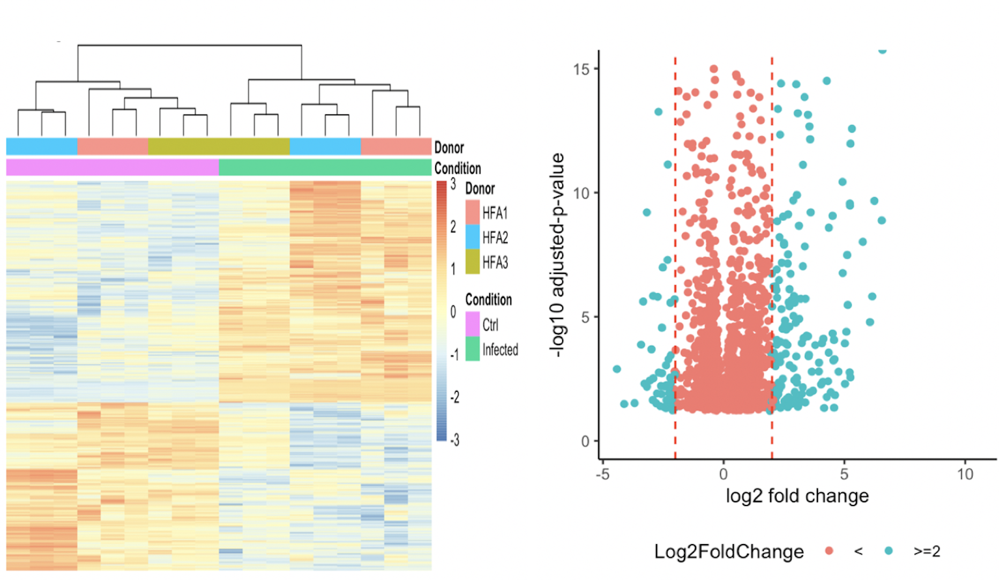
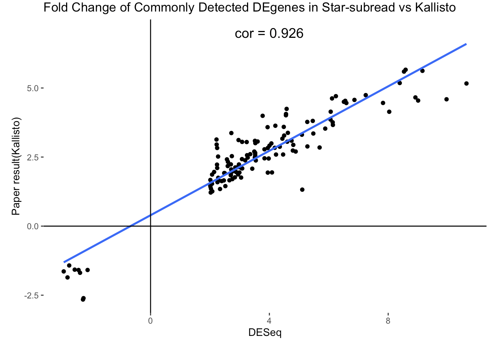
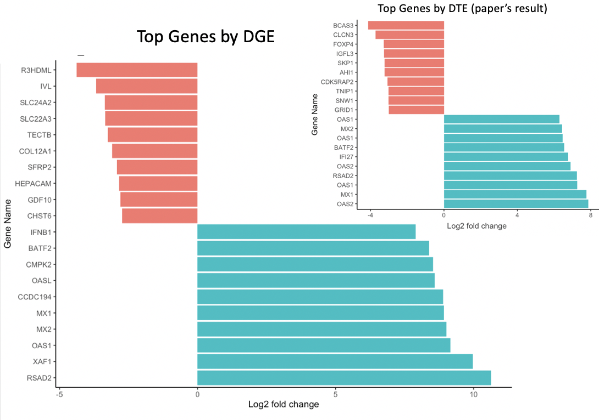
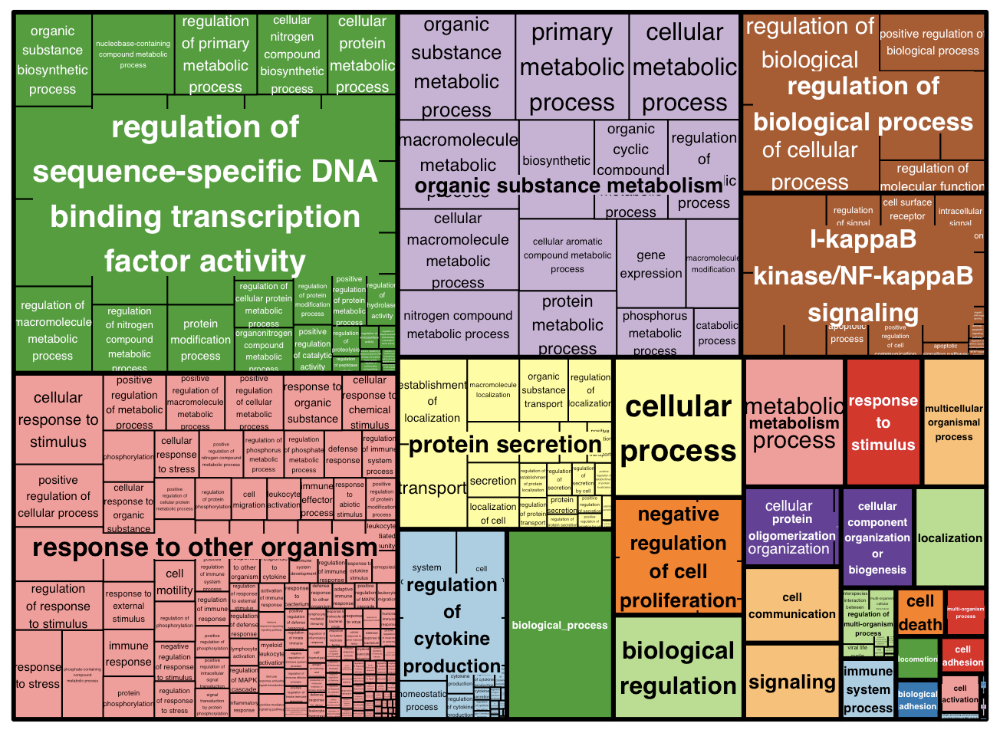

# Introduction   

## BackGround   

### Source paper:
    - Human Fetal Astrocytes Infected with Zika Virus Exhibit Delayed 
      Apoptosis and Resistance to Interferon: Implications for 
      Persistence. *Daniel Limonta, Juan Jovel, Anil Kumar, et al.* 
      Viruses 2018, 10, 646.    

### Speculation:   
    - Human Fetal Astrocytes (HFAs) possibly functioned as Viral 
      reservoirs that may contribute to the establishment of chronic 
      brain infection and neurodevelopmental abnormalities.   

##Project Goal        
    - To compare with the origional paper's result:    
        - Whether there is deregulation of genes that affect morphogenesis, 
          cell adhesion.     
        - Whether the top upregulated genes are associated with 
          antiviral defense.    
        
    - To find if there is gene level eveidence that support experiment 
      observation of moderate apoptosis and inefficient antiviral response.

# Method          
## Sample 
    - 3 HFA samples from 15 to 19-week aborted fetuses.     
    - Positive Control: continuous human cell lines A549 cells 
      overexpress AXL.   
    - Condition: infected with Zika virus and non-infected    
    - Replication: 3    

## Bioinformatic    
    - FASTQC: all passed without trimming    
    - Genorme: Index generated with Ensemble GRCh38.99     
    - Alignment: Star default twopassMode      
    - Post Alignment QC: all passed     
    - DEseq      
    - DEXseq   

# Result    
## Genes Expression HFA infected vs non-infected       
    - 266 genes were upregulated, while 55 genes were downregulated 
      with differential expression of more than 2 log2-fold and 
      adjust-pvalue < 0.05    
{width=700px, height=300px}

## Commonly Detected DEG Paper's result vs This Project's analysis   
    - 134 genes are commonly detected (321 in our analysis, 391 in 
      paper's result), the correlation of commonly detected genes' 
      log2-fold change is 0.926.
{width=600px, height=400px}    
    
## DGE HFA infected vs non-infected     
    - RSAD2, OAS1, MX2, MX1, and BATF2 (viral response) were were 
      consistently shown as top upregulated genes.
    - FOXP4 gene (development of the central nervous system) wasn’t 
      a significant result in our analysis.    
    - Downregulation of TECTB (Alzheimer Disease) and SFRP2 (dopamine 
      neuron development).    
{width=700px, height=350px}    

## Gene Ontology treemap of DEgene with at least log2 fold changes in HFA       
    - top upregulated genes are mostly associated with defense response 
      to virus, virus production. (consistent with the paper's analysis)   
    - morphogenesis of epithelium, cell adhesion (paper's analysis) were 
      not found with DEgenes, but were found with genes associated with DEX.
{width=600px, height=300px}

## Interaction Effect of CellType: Infection HFA vs A549     
    - In-vitro observation: moderate apoptosis in HFA        
    - At gene level, HFA showed higher expression of genes that
      associated to response to cytokine. 
    - Differential use of exon showed higher presence of MAPK pathway
      associated genes (regulation of cell proliferation/death)    
{width=700px, height=300px}

# Conclusion    
## Conclusion     
    - RNA seq analysis did support arguments that HFA shown upregulation of 
      genes associated with defense response to virus, response to cytokine.   
      
    - Differential Use of Exons are associated with neuron morphology
      development.     
      
    - Differential use of exons in genes associated with regulation of 
      cell proliferation/death, which warrant the need of further research.
 

---
