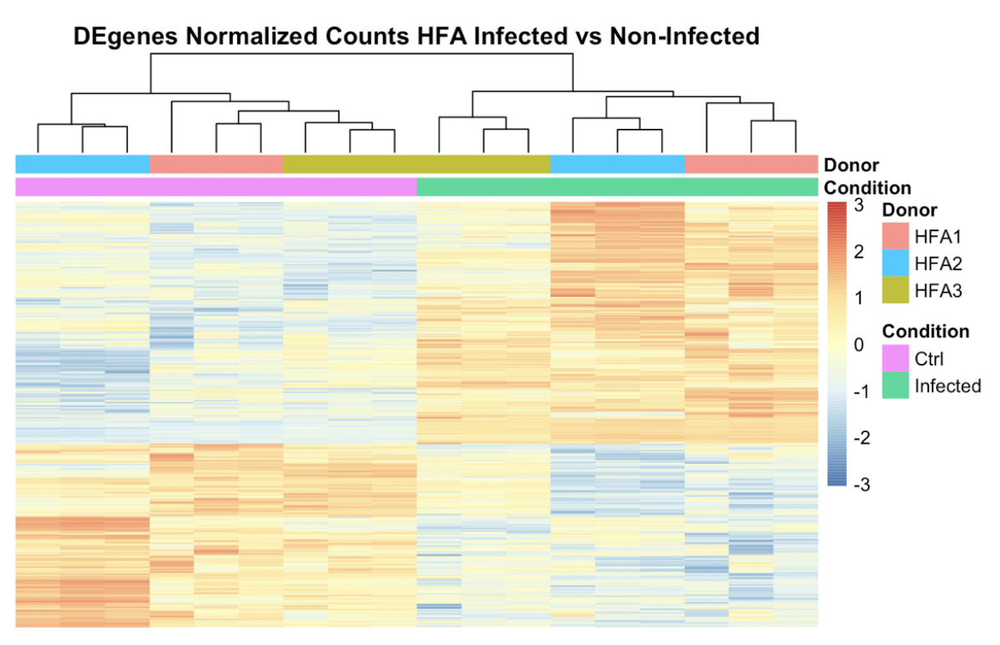
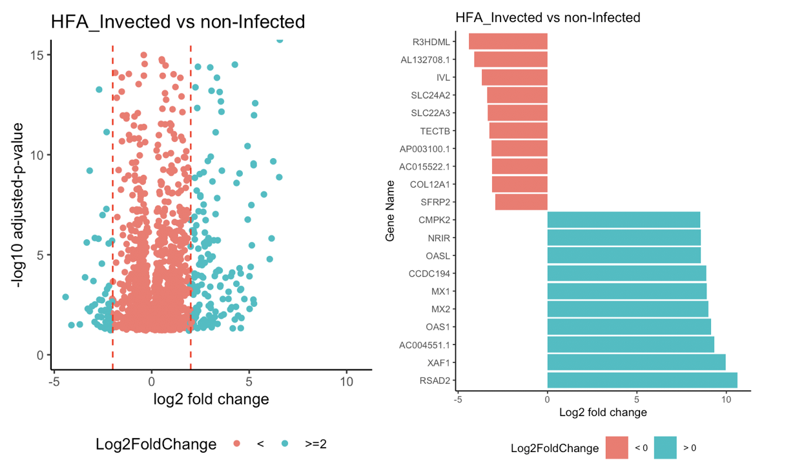
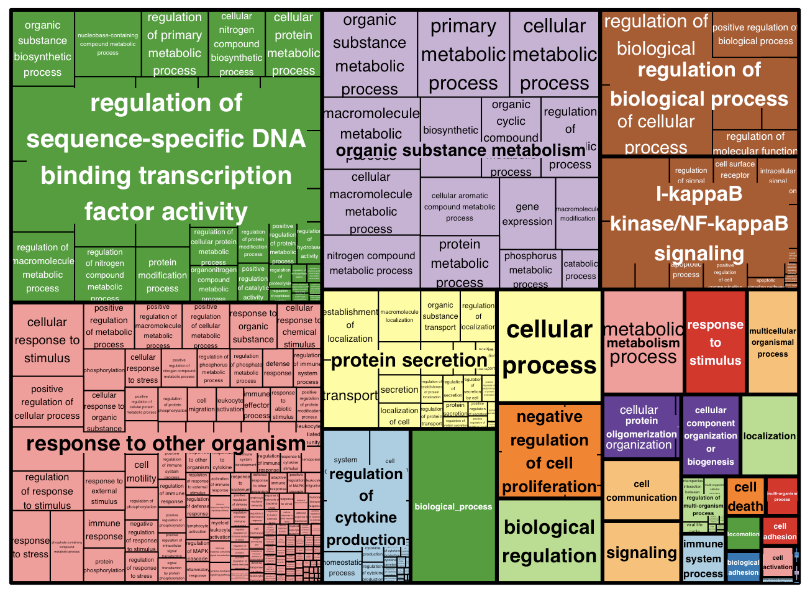
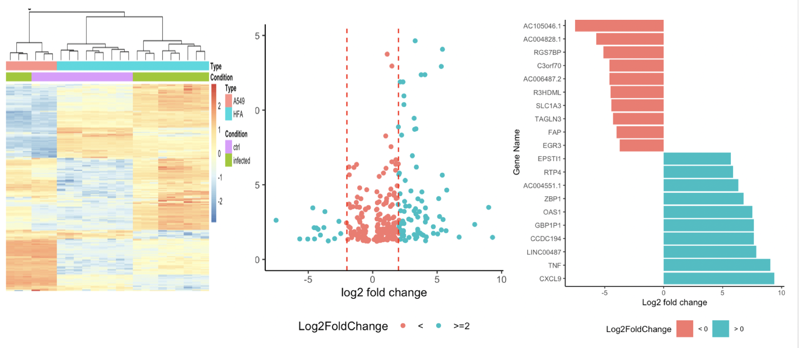
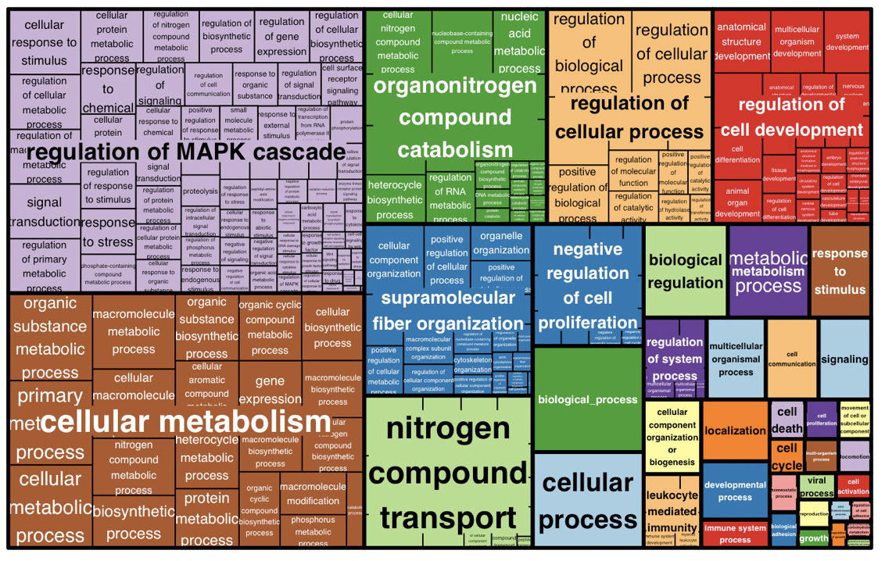

# Introduction   

## BackGround   

###
    - Human Fetal Astrocytes Infected with Zika Virus Exhibit Delayed 
      Apoptosis and Resistance to Interferon: Implications for 
      Persistence. *Daniel Limonta, Juan Jovel, Anil Kumar, et al.* 
      Viruses 2018, 10, 646.    
### Zika Virus  
    - Arthropod-borne virus(transmited by Arthropod)    
    - Genus Flavivirus(positive sense ssRNA,  10–11kb in length)    
### Previous study   
    - in-vitro study had shown that ZIKV replication persists in human 
    fetal neural progenitors (hNPs) for at least 28 days    

## BackGround    
### Speculation   
    - HFAs possibly functioned as Viral reservoirs that may contribute 
      to the establishment of chronic brain infection and 
      neurodevelopmental abnormalities.   
    
### Evidence:  
    - HFAs is permissive to ZIKV infection.     
    - Low level of apoptosis in HFAs.      
    - qrtPCR ZIKV genomes suggest that adaptive mutations were not required.     
    - RNAseq analyses suggests that ZIKV alters host gene expression 
      in a manner that could affect developmental processes.       
      
##Project Goal        
    - To compare with the origional paper's result:    
        - deregulation of genes affect morphogenesis, cell-substrate adherens 
          junction assembly and focal adhesion assembly.     
        - top upregulated genes associated are related with antiviral defense.    
        
    - To find if there is gene level eveidence that support experiment 
      observation of moderate apoptosis and inefficient antiviral response.

# Method          
## Sample 
    - HFAs were obtained from 15 to 19-week aborted fetuses.     
    - Positive Control: continuous human cell lines A549 cells 
      overexpress AXL.   
    - Condition: infected with Zika virus and non-infected    
    - Replication: 3    
    - Total RNA isolated using RNeasy mini kit. 
    - RNAseq libraries prep: TruSeq RNA Sample Prep V2 Kit. 
    - Sequencer: Illumina Hiseq4000.  

## Bioinformatic    
    - QC: fastqc-all passed without trimming    
    - Genorme: Ensemble GRCh38.99     
    - Alignment: Star default twopassMode      
    - Post QC: all passed     
    - DEseq      
    - DEXseq   

# Result    
## Heatmap HFA infected vs non-infected        
{width=700px}

## Volcano plot DEgenes HFA infected vs non-infected     
{width=700px}

## Gene Ontology treemap of DEgene with at least log2 fold changes in HFA        
{width=700px, height=400px}

## Differential Expression of Genes infected-HFA vs infected-A549   
{width=800px, height=400px}

## Genes Differential Use of Exon infected-HFA vs infected-A549    
{width=700px, height=400px}

# Conclusion    
## Conclusion     
    - RNA seq analysis did support arguments that HFA shown upregulation of 
      genes associated with defense response to virus, response to cytokine.   
      
    - Differential Expression of Exons associated with neuron morphology
      development.     
      
    - Differential use of exons in genes associated with regulation of 
      cell proliferation/death, which warrant the need of further research.
 

---
