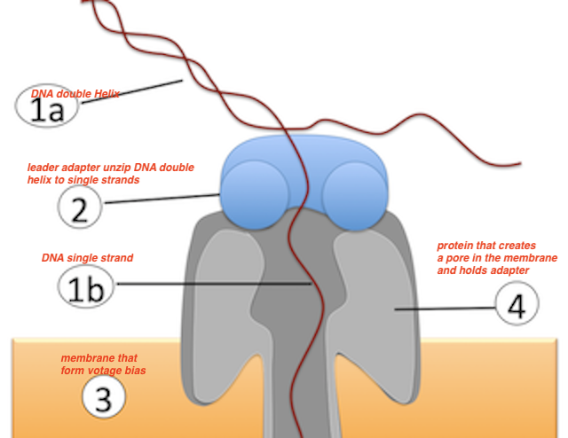

```{r setup, include=FALSE}
knitr::opts_chunk$set(echo = TRUE)
```

###1. Explain basic principles of Nanopore sequencing. (10pts total)    
###Find peer-reviewed information about the Nanopore sequencing technique as employed by Oxford Nanopore Technologies (ideally including at least one describing the MinION technology in detail). Cite the references you found useful to address the following questions (0.5 pts for the citations alone)    
Single-nucleotide discrimination in immobilized DNA oligonucleotides with a biological nanopore. *David Stoddart, Andrew J. Heron, Ellina Mikhailova, et al.* Proc Natl Acad Sci U S A. 2009 May 12; 106(19): 7702–7707    
Comprehensive comparison of Pacific Biosciences and Oxford Nanopore Technologies and their applications to transcriptome analysis. *Jason L Weirather, Data Curation, Formal Analysis, et al*, Version 2. F1000Res. 2017; 6: 100    
The Oxford Nanopore MinION: delivery of nanopore sequencing to the genomics community, *Miten Jain, Hugh E. Olsen, Benedict Paten & Mark Akeson*, Genome Biology volume 17, Article number: 239 (2016)    
MinION Analysis and Reference Consortium: Phase 1 data release and analysis, *Camilla L.C. Ip,Matthew Loose,John R. Tyson*, Version 1. F1000Res. 2015; 4: 1075.    


###In one sentence, summarize the principle of Nanopore sequencing. (1pt)    
detect bases of a single-stranded DNA (ssDNA) molecule by sensoring measures the changes in the ionic currentthat passes through a nanopore with no theoretical limits on read length.     

###Label the following image. (2.5pts)    


###Describe 2 properties that the molecule labeled with (4) must have. (2pts)    
Form nano pore on lipid membrain that allow ssDNA pass through at reduced speed  
able to bind to lead/hp adapters to guide/unwind the dsDNA strand  
form pore with structure that n mer base can be discrimintated by measuring current change from the baseline pore current during strand imobilizaiton  

###Where is the change of current registered? (1pt)  
current residule of n-mer measured at cis entrance to central constrain in the pore portein.    
microchip called the application-specific integrated circuit (ASIC).    

###Which naturally occuring types of proteins could be used for the molecule labeled with (2) and why, i.e. what are the properties that are needed? (1pt)    
DNA polymerase.  can recognize 5' tailing sequence, unwinding dsDNA to ssDNA.       

###There are three types of adapters that are ligated to the DNA prior to sequencing. Explain their functions. (3pts)    
library preparation, repire end, tailing    
leader adapter 5' start "sequencing process", bind to pore protein, load with with motor protein; unwinding dsDNA 
hairpin adapter form a hairpin structure between template and complementary strand, bind with pore protein, indicate complementary strand start      

###2. Describe 2 advantages and 2 disadvantages of Nanopore sequencing compared to Illumina-based sequencing. (4pts total)    
| Illumina     |   Nanopore  |    
|---------------|---------------------|    
|based on synthesis reagent required| no reagent required |     
|fragment length selection; < 700bp|  read untill; long fragment |    
| high accuracy |  higher error rate; especiall short fragment |     
| good for quantitive abandence analysis | 2D read at most|     

