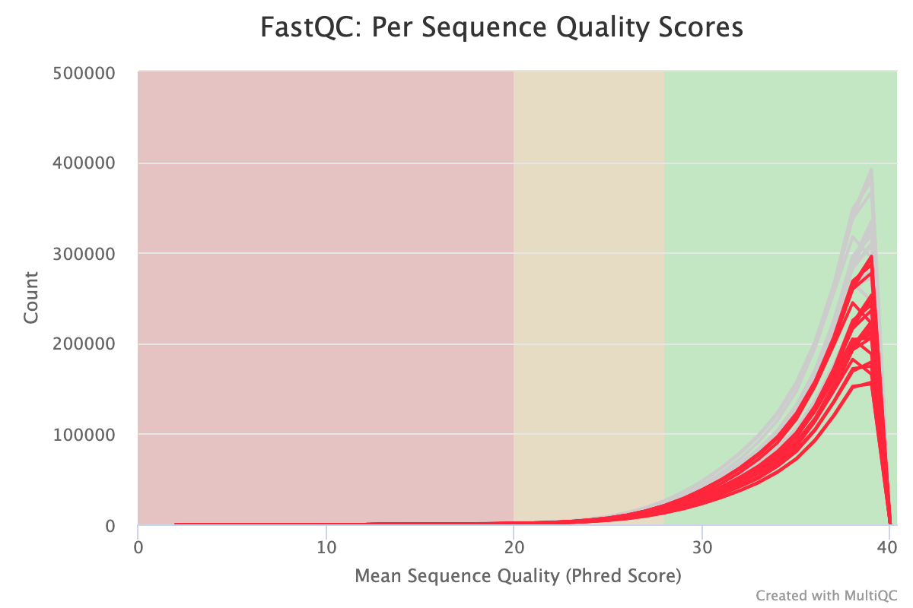

```{r setup, include=FALSE}
knitr::opts_chunk$set(echo = TRUE)
```

## Questions (6pts)  

### 1.Which base call is more likely to be incorrect – one with a Phred score of # or one with a Phred score of ;? (1pt)  
```{r}
strtoi(charToRaw("#"), 16L)  # decimal of ascii "#"
strtoi(charToRaw(";"), 16L)  # decimal of ascii ";"
```
Though the coding offset might be different in different CASAVA verisons, the decimal code representation of ";" is greater than that of "#", therefore "#" indicates a higher Pred score.  

### 2.Explain at least 2 reasons for base calling uncertainties (i.e. what factors could explain lower than expected/desired sequencing scores) and how they can be avoided/alleviated. (2pts)  
    a. flourscent sillover/cross-talk matrix not properlly calibarated. 
    b. cross-talk between adjacent clusters
    c. not throughly wash between cycles led to phasing  

### 3.What is the baseline uncertainty that Illumina attaches to its base calls? In other words, how likely is it that a base call is wrong even if it got the highest possible Phred score of 41? How many bases can you therefore expect to be wrong in a file with 1 million 50bp-long reads? Does this concern you? (Justify your answer) (3pts)  
```{r}
10^(-41/10)
```
Pred score is determined by $Q = − 10 log_{10} P$. for a max Pred score 41 the probability of error rate is 7.943282e-05.  
```{r}
ceiling(10^(-41/10) * 50 * 10^6)
```
3972 bases is expected to be wrong with 10^6 50bp-long reads.  
```{r}
(1-10^(-41/10))^50
```
The probability of faithfuly copy of the 50bp-long read is 0.9960361. acceptable.  

## Exercises (with questions) (9pts)  

### 1.Download more FASTQ files from the Gierlinski data set so that you have all the technical replicates for 3 WT and 3 SNF2 samples (= 6x7 FASTQ files). Place each set of 7 technical replicates into one sensibly named folder respectively. (1pt)  
Write a for-loop that will run FastQC on all (6x7) of the FASTQ files that you previously downloaded from the Gierlinski dataset.  

```{}
#!/bin/bash 
spack load fastqc

# set current work dir
cwd=/athena/angsd/scratch/jiq4001/HW_Wk4
# master file
master=$cwd/master.tsv
# mapping file
mapping=$cwd/mapping.txt

# filterd download list
for sample in  SNF2
 do
  if [ ! -d $cwd/$sample ]
   then 
    mkdir $cwd/$sample
  fi
  for biorep in 1 2 3 
   do 
    if [ ! -d $cwd/$sample/biorep$biorep ]
     then  
       mkdir $cwd/$sample/biorep$biorep   
    fi
    cd $cwd/$sample/biorep$biorep

    filter=$(cut -d" " -f11 <(join -1 1 -2 4 <(egrep "\s(${sample})\s${biorep}$" $mapping | sort) <(sort -k4 $master)))

    for dw_url in $(echo $filter)
     do
      wget ${dw_url} 
     done
    
    # fastqu to QC directory
    mkdir ./QC
    for file in $(ls)
     do
      if [ ! -d ./QC/$file ] && [ "$file" != "QC" ]
      then mkdir ./QC/$file
      fi
     fastqc $file -o ./QC/$file -t 4 --extract
    done
   done    
 done
```

### 2.Select one sample for which you write an additional for-loop that will:  
  run TrimGalore  
  run FastQC on the trimmed datasets. (2pts)  
  *The libraries were pooled and sequenced on seven lanes of a single flow-cell on an Illumina HiSeq 2000 using a balanced block design (Auer and Doerge, 2010), resulting in a total of ∼1 billion 50-bp single-end reads across the 96 samples.*  

trim sample WT-biorep1 saved to WT/birep1/trimed
```{}
spack load fastqc
spack load -r trimgalore
[jiq4001@buddy biorep1]$ mkdir trimed

for file in $(ls)
do
  if [ "$file" != "QC" ]
  then 
   trim_galore --illumina -o ./trimed $file
  fi
done
```

fastqc on trimed WT-biorep1 saved to WT/birep1/trimed/QC
```{}
[jiq4001@buddy trim_biorep1]$ spack load fastqc
[jiq4001@buddy trim_biorep1]$ mkdir ./QC

for file in $(ls | egrep "*.fq.gz")
do
 fastqc $file -o ./QC -t 4 --extract
done
```

### 3.Describe one detail of the QC results that changes after TrimGalore and one result that stays the same and explain why. (2pts)  
for ID ERR458499:  after TrimGalore   
Sequence length distribution is changed from uniformly around 51 to 20-51 mostly distributed between 48-above with : matched adapter sequence are trimmed led to short remining sequence in some reads.  
Duplication Level was not improved much from 66.01% to 76.71. which suggest that the duplication was not mainly caused by adapter dimmer  

### 4.Combine the initial FastQC results for all 6x7 FASTQ files into one document using MultiQC. You can load the tool using spack load -r py-multiqc. Export one image of either of the results where the SNF2 samples are highlighted in a different color than the WT samples and add it to this report. (2pts)  
```{}
spack load -r py-multiqc
multiqc --help

[jiq4001@buddy HW_Wk4]$ ls
[jiq4001@buddy HW_Wk4]$mapping.txt  master.tsv  run_bash  SNF2  WT
[jiq4001@buddy HW_Wk4]$ ls WT
[jiq4001@buddy HW_Wk4]$biorep1  biorep2  biorep3  trim_biorep1

[jiq4001@buddy HW_Wk4]$ multiqc .  --ignore ./*/*/trim*/ ./*/*/QC/
```

compare trimed and untrimed WT-biorep1 using multiqc
```{}
[jiq4001@buddy biorep1]$ multiqc .  --ignore  ./QC/ ./trimed/*.fq
```



```{r, echo=F, eval=F}
sftp jiq4001@curie.pbtech << EOF
  get /athena/angsd/scratch/jiq4001/HW_Wk4/WT/biorep1/trimed/QC/ERR458493_trimmed_fastqc.html $HOME/angsd/hw_wk4/ERR458493_trimmed_fastqc.html
  get /athena/angsd/scratch/jiq4001/HW_Wk4/WT/biorep1/trimed/QC/ERR458494_trimmed_fastqc.html $HOME/angsd/hw_wk4/ERR458494_trimmed_fastqc.html
  get /athena/angsd/scratch/jiq4001/HW_Wk4/WT/biorep1/trimed/QC/ERR458495_trimmed_fastqc.html $HOME/angsd/hw_wk4/ERR458495_trimmed_fastqc.html
  get /athena/angsd/scratch/jiq4001/HW_Wk4/WT/biorep1/trimed/QC/ERR458496_trimmed_fastqc.html $HOME/angsd/hw_wk4/ERR458496_trimmed_fastqc.html
  get /athena/angsd/scratch/jiq4001/HW_Wk4/WT/biorep1/trimed/QC/ERR458497_trimmed_fastqc.html $HOME/angsd/hw_wk4/ERR458497_trimmed_fastqc.html
  get /athena/angsd/scratch/jiq4001/HW_Wk4/WT/biorep1/trimed/QC/ERR458498_trimmed_fastqc.html $HOME/angsd/hw_wk4/ERR458498_trimmed_fastqc.html
  get /athena/angsd/scratch/jiq4001/HW_Wk4/WT/biorep1/trimed/QC/ERR458499_trimmed_fastqc.html $HOME/angsd/hw_wk4/ERR458499_trimmed_fastqc.html
  get /athena/angsd/scratch/jiq4001/HW_Wk4/WT/biorep1/QC/ERR458493_fastqc.html $HOME/angsd/hw_wk4/ERR458493_fastqc.html
  get /athena/angsd/scratch/jiq4001/HW_Wk4/WT/biorep1/QC/ERR458494_fastqc.html $HOME/angsd/hw_wk4/ERR458494_fastqc.html
  get /athena/angsd/scratch/jiq4001/HW_Wk4/WT/biorep1/QC/ERR458495_fastqc.html $HOME/angsd/hw_wk4/ERR458495_fastqc.html
  get /athena/angsd/scratch/jiq4001/HW_Wk4/WT/biorep1/QC/ERR458496_fastqc.html $HOME/angsd/hw_wk4/ERR458496_fastqc.html
  get /athena/angsd/scratch/jiq4001/HW_Wk4/WT/biorep1/QC/ERR458497_fastqc.html $HOME/angsd/hw_wk4/ERR458497_fastqc.html
  get /athena/angsd/scratch/jiq4001/HW_Wk4/WT/biorep1/QC/ERR458498_fastqc.html $HOME/angsd/hw_wk4/ERR458498_fastqc.html
  get /athena/angsd/scratch/jiq4001/HW_Wk4/WT/biorep1/QC/ERR458499_fastqc.html $HOME/angsd/hw_wk4/ERR458499_fastqc.html
  get /athena/angsd/scratch/jiq4001/HW_Wk4/multiqc_report_1.html $HOME/angsd/hw_wk4/multiqc_report_1.html
  get /athena/angsd/scratch/jiq4001/HW_Wk4/WT/biorep1/multiqc_report_1.html $HOME/angsd/hw_wk4/multiqc_report_1.html
EOF

sftp jiq4001@aristotle.med.cornell.edu << EOF
  get /home/jiq4001/angsd/hw_wk4/ERR458493_trimmed_fastqc.html ./ERR458493_trimmed_fastqc.html
  get /home/jiq4001/angsd/hw_wk4/ERR458494_trimmed_fastqc.html ./ERR458494_trimmed_fastqc.html
  get /home/jiq4001/angsd/hw_wk4/ERR458495_trimmed_fastqc.html ./ERR458495_trimmed_fastqc.html
  get /home/jiq4001/angsd/hw_wk4/ERR458496_trimmed_fastqc.html ./ERR458496_trimmed_fastqc.html
  get /home/jiq4001/angsd/hw_wk4/ERR458497_trimmed_fastqc.html ./ERR458497_trimmed_fastqc.html
  get /home/jiq4001/angsd/hw_wk4/ERR458498_trimmed_fastqc.html ./ERR458498_trimmed_fastqc.html
  get /home/jiq4001/angsd/hw_wk4/ERR458499_trimmed_fastqc.html ./ERR458499_trimmed_fastqc.html
  get /home/jiq4001/angsd/hw_wk4/ERR458493_fastqc.html ./ERR458493_fastqc.html
  get /home/jiq4001/angsd/hw_wk4/ERR458494_fastqc.html ./ERR458494_fastqc.html
  get /home/jiq4001/angsd/hw_wk4/ERR458495_fastqc.html ./ERR458495_fastqc.html
  get /home/jiq4001/angsd/hw_wk4/ERR458496_fastqc.html ./ERR458496_fastqc.html
  get /home/jiq4001/angsd/hw_wk4/ERR458497_fastqc.html ./ERR458497_fastqc.html
  get /home/jiq4001/angsd/hw_wk4/ERR458498_fastqc.html ./ERR458498_fastqc.html
  get /home/jiq4001/angsd/hw_wk4/ERR458499_fastqc.html ./ERR458499_fastqc.html
  get /home/jiq4001/angsd/hw_wk4/multiqc_report_1.html ./multiqc_report_1.html
  get /home/jiq4001/angsd/hw_wk4/multiqc_report_1.html ./multiqc_report_trimed_1.html
EOF
```

### 5.Based on the QC, would you be justified in combining any of the FASTQ files given that they are technical replicates? (1pt)  
the 4th technical replica of each biological sample showed lower sequence quality in range 5-10 bass. one could remove reads showing low quality score then combine the files. (is there standard rule for ignoring batch effect? )    

### 6.Even if the answer to the previous question is “no”, what command(s) would you use to combine the several FASTQ files into one? (1pt)  
```{r, eval=FALSE}
cat *.fastq > merged.file
```

### 7.Bonus point: If you had to determine the version of the Sanger quality score encoding used in a given FASTQ file without the help of FastQC, what would you do?  
```{r, eval=FALSE}
test="adhDDS"
while read -n 1 char 
  do echo $(printf "%d\t" "'$char") - 33 | bc 
done <<< $test
```

## Project work (4pts)  

### 1.Expand your project ideas. Come up with (at least) one specific hypothesis that you want to test.  
To compare how different library preparations(PolyA selection and NuGEN(Depletion of highly-abundant transcripts) library preparation) affect the downstream analyses.  
Hypothesis: 
    a.There is no difference in 2 library preparation protocols in Sequence Alignment and Gene Level Expression Quantification 
        mapping rate of each library preparation protocols is compared   
    b.There is no difference in 2 library preparation protocols in Differentially Detected/Expressed Gene Detection  
        commonly detected differentially expressed genes between biological conditions with different library preparation protocols
      
### 2.Specify the data you will need.   
    Locate potential datasets and describe them (when/where were they generated, what sequencing platform was used, etc).  
    Think about possible biases or technical problems that you might run into if you were to use these data. (remember the lecture about experimental design!)  
    
RNA-seq experiment for 8 breast cell lines whose sequence libraries were prepared by both the Illumina PolyA selection and the NuGEN Ovation RNA-Seq kit.   
Data access:  https://www.ncbi.nlm.nih.gov/Traces/study/?acc=SRP026013&o=acc_s%3Aa initially submitted on	Jun 13, 2013.  
The paired-end sequencing at 51 cycles (50 bases each end) was carried out for both the NuGEN and Illumina PolyA preparations.   
The former was conducted by GAIIx sequencer and the later was by HiSeq 2000 at Mayo Clinical Medical Genomics Facility.  
The sequence outputs were different from two generations of Illumina platform, which potentially confounded the results  
    