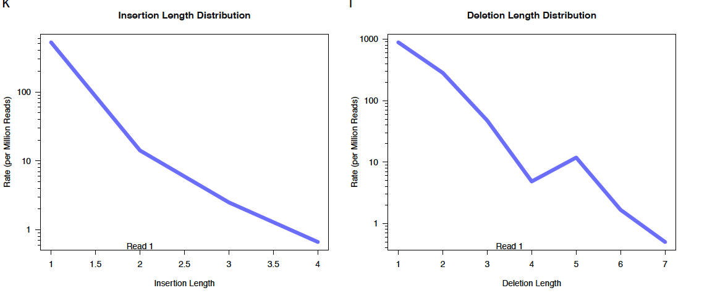
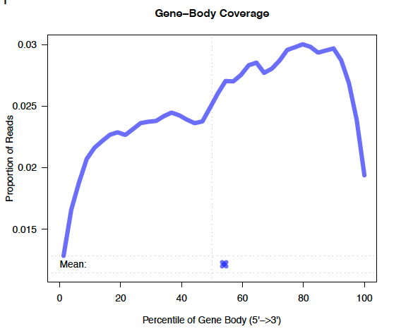
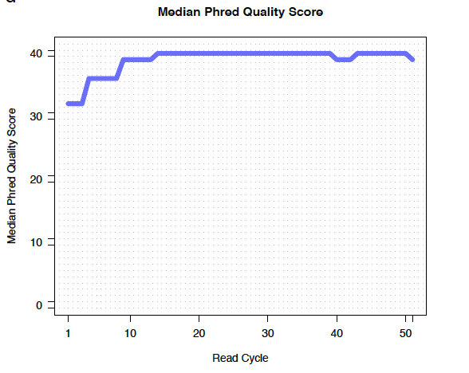

```{r setup, include=FALSE}
knitr::opts_chunk$set(echo = TRUE)
```

##RNA properties (5pts)  

###Why are researchers interested in studying mRNA using RNA-seq, i.e. what can we learn from an RNA-seq experiment in contrast to a genomic DNA sequencing experiment? (1pt)  
RNA-seq is a high-throughput technology that allow researchers to quantify multiple mRNA in the same experiment.  
A individual carries the same set of DNA(if not studing mutation), as to questions such as phenotype, which related to selected expression/level of expression of genes from the same set of DNA, one needs to study mRNA quantitively, in the assumption that the copies of mRNA has positive association with the level of transcription activity, and hopefully the level of association between different mRNA not variate greatly.  

###Explain the differences between coding and non-coding RNAs (2pts):  
###which functions do they have?  
cRNA: RNA that is able to be translated into protein.  
ncRNA: RNA that is not translated in to protein, such as tRNA, rRNA, and some with functions not identified.  

###which structural features set them apart from each other? (Think, for example, about properties that might be exploited to enrich one population of RNA over another)  
A fully processed mRNA includes a 5' cap, 5' UTR, coding region, 3' UTR, and poly(A) tail. poly(A) tail is often used to enrich mRNA in library preparation.    

###Why can genetic mutations in introns be harmful? Name two possible scenarios that involve different underlying mechanisms. (1pt)  
mutations in introns can introduce novel splice sites, change promoter activities.  
SNP: point mutation in introns    
Indels: Insertions/deletions in intronic areas may carry larger effects insce it involves longer base pairs.  

###Describe the difference between the transcription start site and the promoter. (1pt)  
promoter is a sequence on DNA upstream the 5'-end of a gene sequence that include the transcription start site.  

##Alignment QC (5pts)  

###Which problem of mRNA-sequencing can be detected with FastQC? Explain how. (2pts)  
###rRNA contamination  
depends/no  
###mRNA degradation  
no  
###genomic DNA contamination  
depends/no  
FastQC quantified per-base level quality of the sequencing step. one is able to identify over present in distribution of certain base at certain read length. unless the contamination is in the form of high level of duplication, FastQC wont be able to tell.  

###Generate plots for (a) assessing the read distribution across exons/introns/etc. and (b) to determine the average gene body coverage. You can use either tool that we mentioned in class. (2pts)  
```{r, eval=F}
[jiq4001@node141 HW_Wk7]$ spack load samtools@1.9%gcc@6.3.0


[jiq4001@node141 HW_Wk7]$ spack load qorts@1.2.42
[jiq4001@node141 HW_Wk7]$ QORTS_LOC=`spack location -i qorts`

[jiq4001@node141 HW_Wk7]$ cwd=/athena/angsd/scratch/jiq4001/
# index align out
[jiq4001@node141 HW_Wk7]$ samtools index ${cwd}/HW_Wk6/Star_align/WT_biorep1_cmb.Aligned.sortedByCoord.out.bam 


[jiq4001@node141 HW_Wk7]$java -Xmx4G -jar ${QORTS_LOC}/bin/QoRTs.jar QC --singleEnded \
--generatePdfReport \
${cwd}/HW_Wk6/Star_align/WT_biorep1_cmb.Aligned.sortedByCoord.out.bam \
${cwd}/HW_Wk6/sacCer3.sgd.gtf \
WT_biorep1_cmb    ## output is a folder 
```

{width=900px}
{width=450px}, {width=450px}


```{r, eval=F}
spack load -r py-multiqc
multiqc --help

```

###Why is a 3’ bias in the gene coverage plot evidence of RNA degradation? What type of enrichment step is particularly prone to overrepresenting the 3’ ends? (1pt)  
poly-A library preparation is prone to overrepsesenting 3'end, since the method enriches mRNA sequences that include poly-A.  
If degradation occured, by poly-A enrichment, degraded shorted sequences with poly-A 3'end are more likely to present in the library. therefore after sequencing, the distribution of gene-coverage would squeue to the 5' end, compare to with good RIN score, the distribution of gene-coverage is more likely to show evenly coverage from 5' to 3'.  

##Counting reads (7pts)  
###Use featureCounts to count the number of reads that overlap with every exon. As usual, keep track of all the commands. You can use the BAM files from /home/frd2007/ANGSD_2019/alignment if you don’t have them in your home directory. Briefly explain at least 2 parameters (and their consequences!) that you’re using (can include parameters set to default mode, but not parameters that specify input and output file names). (2 points)  
```{r, eval=F}
[jiq4001@node141 HW_Wk7]$ spack load subread
[jiq4001@node141 HW_Wk7]$ featureCounts --help

[jiq4001@node141 HW_Wk7]$ featureCounts -a ${cwd}/HW_Wk6/sacCer3.sgd.gtf \
-o featCounts_Gierlinski_genes.txt \
--minOverlap 3 \
-t "exon" \   ## need exact text in gtf file 
-g "gene_id" \
--extraAttributes "exon" \
--primary \
--tmpDir '/scratchLocal' \
/home/frd2007/ANGSD_2019/alignment/*.bam 
```
  
--primary primary alignments only  
--minOverlap Minimum number of overlapping bases in a read that is required for read assignment  
-C Do not count read pairs that have their two ends mapping to different chromosomes or mapping to same chromosome but on different strands.  
-t feature to count  
-g attribute to be summarize  


###Read the summary files generated by the featureCounts run shown during class and the one you just did into R. Generate a bar plot (using ggplot2) that displays the numbers of assigned and unassigned reads for either featureCounts run. The plot below is an example, you do not need to generate an exact replicate (you may also have run your featureCounts with slightly different parameters, so you may not even be able to replicate it exactly). (2 points)  
```{r, echo=F}
library(data.table)
suppressMessages(library(tidyverse))
```
```{r}
r_exon <- fread("featCounts_Gierlinski_genes.exon.txt")
r_gene <- fread("featCounts_Gierlinski_genes.gene.txt")

rename <- gsub("_Aligned.*$", "", x = colnames(r_exon))
rename <- gsub("^.*alignment/", "", x = rename)
colnames(r_exon) <- rename
colnames(r_gene) <- rename


r_exon$file <- rep("by_exon", nrow(r_exon))
r_gene$file <- rep("by_gene", nrow(r_gene))
r_exon
r_gene

r_exon %>%
  rbind.data.frame(r_gene) %>%
  filter(Status == "Assigned" | Status == "Unassigned_NoFeatures" | Status == "Unassigned_Overlapping_Length" | Status == "Unassigned_Ambiguity") %>%
  gather(-Status, -file, key = "sample", value = "reads") %>%
  ggplot()+
  geom_bar(aes(sample, reads, fill = Status), stat = "identity", position = "stack")+
  facet_wrap(~file)+
  theme(axis.text.x = element_text(angle = 90, hjust = 1))
```


###Describe at least two observations from the plot including an explanation of what they mean. (2 points)  
feature to count: exon. Left: summarize by exon; Right: summarize by gene  
feature to count == sumarize level, only shows Assigned and noFeature status.  
Unassigned_Ambiguity reads comes in when summarizing level is not the same as feature level. unAssigned ambiguity referes to unAssigned due to overlapping with two or more features    
Unassigned Overlapping Length: meta-features were found to have the minimum required overlap length.  

###Download an annotation file (GTF) for one mammalian model organism of your liking. Determine the different types of loci that are annotated within that file and how many times each type is present in that file (you may want to look into the uniq UNIX command). (1pt)  
```{r, eval=F}
# cat genom annotation  cat.nov2017.felCat9
[jiq4001@node141 HW_Wk7]$ egrep ".*LOC.*" cat.nov2017.felCat9 | cut -f13 | uniq -dc >> LOCI_count #count duplicate
[jiq4001@node141 HW_Wk7]$ egrep ".*LOC.*" cat.nov2017.felCat9 | cut -f13 | uniq -u  >> LOCI_count #list duplicate
```
Example:  
      5 LOC109496181  
     10 LOC102900020  
      2 LOC109496006  
      4 LOC109496011  
      --------  
      --------  
      1 LOC111559161  
      1 LOC111559164  
