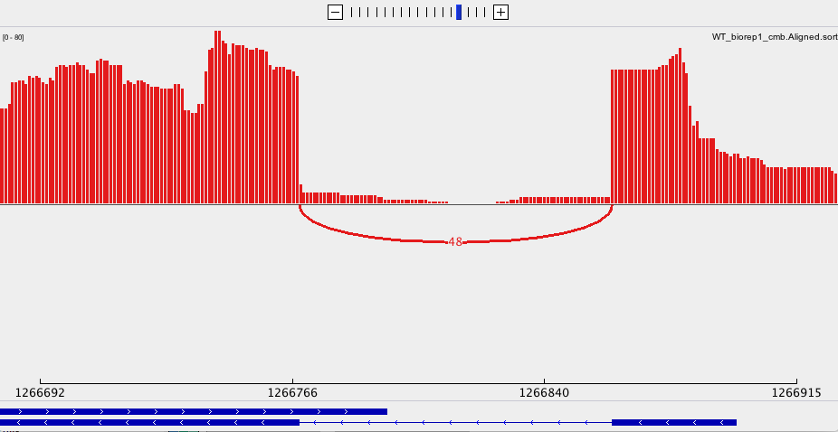

```{r setup, include=FALSE}
knitr::opts_chunk$set(echo = TRUE)
library(DESeq2)
library(magrittr)
library(ggplot2)
```

###Inspecting BAM files (1pt)  

###Download the Integrative Genomics Viewer from the Broad Institute. Download 2 BAM files from the Gierlinski data set to your computer and load them into the IGV Browser. Find a gene with at least one intron and take a Sashimi plot that you include in your html file.  
Strand_ -, Depth:48 Location:chrIV-1,266,710-1,266,899  

{width=700px}  

###Understanding read counts (9pts)  

###Describe 2 properties of RNA-seq read count data that researchers have identified – i.e. what are some of the reasons why we cannot take the read counts at face value? Please also describe the adjustments that need to be made to use them as more reliable proxies for gene expression evaluations. (4pts)  
Raw read counts might not be valid in term of variations in 1.sequencing depth: this specially affact inter-sample comparasion, the whole genome needs to receive sufficient coverage. 2. gene length: with same amount of materials, short genes are likely to be completely covered than longer genes. 3. gc content: with same amount of materials, gc draws more preference in PCRs that got more copies than fragment having low gc. 4. genes own expression level: some fragments might having more copies due to biological reasons.    
Normalization needs to be done prior to downstream analysis. for example using TPM(trascripts per million), it normalized a gene's read count per bp by sum of all other genes' reads count per bp.  
$TPM_i = X_i/l_i \times 1/\sum_j(X_j/l_j) \times 10^6$  

###What is the main difference between exploratory analyses and the tests for differential gene expression in terms of the types of questions that can be addressed with either one? (1pt)  
Exploratory analyses do not test a null hypothesis, is more quanlitively, such as association or clustering.  
Differential gene expression test against null hypothesis.  

###Exploratory analyses of DESeq.ds objects: generate a dendrogram and a PCA plot of our 10 samples and briefly explain the major insights you can derive from them. You may use the code detailed in https://physiology.med.cornell.edu/faculty/skrabanek/lab/angsd/lecture_notes/08_practical_exploratory.pdf, but make sure to explain what every (!) function does and what type of output each function generates. Can you infer what the pcaExplorer plots of the “Top Loadings” represent? (4pts)  

*data preparation*  
```{r}
# read data table
rc0 <- read.table("featCounts_Gierlinski_genes.txt", header=TRUE, row.names = NULL)

# trim extra text from colname
names(rc0) <- gsub("X.home.frd2007.ANGSD_2019.alignment.", "", names(rc0))
names(rc0) <- gsub("_Aligned.sortedByCoord.out.bam", "", names(rc0))
str(rc0)

# generate rowname with GeneId
row.names(rc0) <- make.names(rc0$Geneid, unique = T) 
readcounts <- rc0[ , -c(1:6)]

# create condations with colnames from readcount
sample_info <- DataFrame(condition = gsub("_[0-9]+", "", names(readcounts)),
row.names = names(readcounts) )

# wrap reads, condation into object
DESeq.ds <- DESeqDataSetFromMatrix(countData = readcounts,
colData = sample_info,
design = ~ condition)

# normalization
DESeq.ds <- estimateSizeFactors(DESeq.ds) 

log.norm.counts <- log2(counts(DESeq.ds, normalized=TRUE) + 1)
assay(DESeq.ds, "log.norm.counts") <- log.norm.counts
```
*dendrogram* 
```{r}
# pearson correlation 
corr_coeff <- cor(assay(DESeq.ds, "log.norm.counts"), method = "pearson")
# use cor plot dendrogram
as.dist(1 - corr_coeff) %>% 
  hclust %>%
plot( ., labels = colnames(corr_coeff),
      main = "Dendrogram of rlog transformed read counts", sub = "")
```

overall, 10 samples are clustered to mainly 2 clusters, SNF2 and WT.  
there are not much difference from those 5 repeats(indicated by height) of SNF2, even though they were clustered and branched out.  
The 5 bioreps of WT showed more variations than the reps of SNF2  

```{r}
# PCA cluster on dimentions that reduce the most variations
# caculate var of 10 samples per geneid
rv <- rowVars(assay(DESeq.ds, "log.norm.counts"))
# select geneid with top 500 varation
top_variable <- order(rv, decreasing = TRUE)[seq_len(500)]
pca <- prcomp(t(assay(DESeq.ds, "log.norm.counts")[top_variable, ]))

plot(pca$sdev, main = "first 3 PC explains most variation of the samples")
points(x = 3, y = pca$sdev[3], col = "red")

# reduction of variance of each PCs
var_reduction <- 100-(pca$sdev)/sum(pca$sdev)*100
var_reduction <- var_reduction - c(0, var_reduction[1: (length(var_reduction)-1)])
paste("reduction of variance of each PCs")
data.frame(PCs = paste0("PC", 1:10), var_reduction = var_reduction)


plot(pca$x[,1], pca$x[,2], col = c(rep(2,5), rep(4,5)), 
     xlab = "PC1 67.72% variance",
     ylab = "PC2 17.31% variance")
text(pca$x[,1], pca$x[,2], labels = row.names(pca$x), cex = .75, font = 8,
     col = c(rep(2,5), rep(4,5)))

```
```{r,eval=FALSE}
#BiocManager::install("pcaExplorer")
library(pcaExplorer)
DESeq2.rld <- DESeq2::rlogTransformation(DESeq.ds)
pcaExplorer(DESeq.ds, DESeq2.rld)
```
$\bar{w} = \sum_i^n p_iw_i$ is the weighted count mean  
loading is defined by $L= (w_max - \bar{w})/w_max$  max or min difference from the mean.  
top loading summarise the gene that with top max/min readscount observed.  


###Understanding DESeq2 S4 objects. (5.5pts total)  

###As we briefly discussed during class, DESeq2 (and many other bioconductor packages) often use very specific and elaborate R objects to combine observations (e.g. counts, normalized expression values, etc.) with corresponding meta data (e.g., gene IDs, sample IDs, sample conditions, gene ranges etc.). These objects are usually based off the S4 convention and if you are interested in the nitty-gritty details, we can recommend the bioconductor team’s write-up. If you do not know what type of object you are dealing with, class(object) is the function that releases that information. If the result isn’t one of the base R classes you learnt about during Luce’s class (e.g. data.frame, matrix, list), it is highly likely an S4 object. To get more background information, e.g. about how to interact or generate a certain object, you can always resort to the generic help call that you should be familiar with for functions, such as ?list or ?data.frame. To explore an S4 object more, you can use the function showClass, which expects the result of class(object) as an input (e.g. class(object) %>% showClass). You can think of S4 objects as sophisticated lists insofar as they allow the combination of different types of objects. But where the content of lists can be accessed via the same accessors that are used for data.frames (e.g. list$stored_object1 or list[["stored_object1"]], S4 objects use different accessors called slots, whose content you can retrieve using the @ symbol or via specific accessor function provided by the parent package, e.g. DESeqObject@counts or counts(DESeqObject). Which slots are present in a given S4 object can be determined via slotNames(object).  


###Use the functions we’ve described to inspect the objects that are returned by rlog() and DESeqDataSetFromMatrix, respectively. You can also try to just type their name in the console and hit return and see what happens.  

```{r, eval=F}
rlog_re <- rlog(DESeq.ds)
rlog_re@colData$condition
?DESeqDataSetFromMatrix
list(DESeq.ds@assays@data)
```

###Describe at least 2 similarities and 2 differences between them in regards to their content and the downstream functions you may have to use to interact with them. Feel free to use any additional documentation available, just let us know how you found each answer. (4pts)  
rlog(): wrapped function to caculate *sizeFacto*r, can be pull from colData slot  
DESeqDataSetFromMatrix)(): have to manualy do *sizeFactor*, result also will be stored in colData slot  
DESeqDataSetFromMatrix)(): store assay *design* as formula, which will be used as treatment levels in down stream lest say regression analysis.  
rlog(): doesnt store *design* information in S3 level under @ colData$condition     

###How can you extract the expression values stored in either object? (1pt)  
S4 level: ues @  
S3 level: use $
for example:  
```{r, eval=F}
rlog_re@colData$condition   
rlog_re@assays@data@listData[[1]][1,]
list(rlog_re@assays)
```


###How can you add an additional matrix named “my_personal_normalization” to either object? (You do not need to make up new values for this; just use the same expression values already stored in either object and assign it using a new name.) (0.5pt)  
```{r}
assay(DESeq.ds, "my_personal_normalization") <- DESeq.ds@assays@data[[1]]
DESeq.ds@assays@data$my_personal_normalization[1,]
```


###Inspecting the source code of R functions (1.5pts)  

###Read the instructions here. Note that the getMethods() described there has been deprecated and has been replaced by findMethods(), which does not require you to specify the object type for which you’re retrieving the code.  
###Include the source code of the following DESeq2 functions in your homework’s html:  
###rlog()  
```{r}
getAnywhere("rlog")
```

###estimateDispersions()  
```{r}
getAnywhere("estimateDispersions")
```

###rlogData() – this is a non-exported function from DESeq2  
```{r}
getAnywhere("rlogData")
```

###Understanding DE analysis (4pts (plus 2 pts for extra credit))  

###In your own words, describe how DESeq2 calculates a p-value that you can use to decide whether a given gene shows different expression values when comparing two conditions of interest. Start from what types of values are used as the measurements. You may consult the document on our website that contains a verbose summary of what we talked about in class. (3pts)  

###Despite the fact that we are testing each gene individually, which calculations/values are influenced by the values of the other genes in the same matrix? Explain at least one. (1pt)  

###Bonus question (not required): From the source code of nbinomWaldTest(), identify the relevant line where the Wald statistic is calculated. Explain what the objects contain that are used for the calculation. (2pts for extra credit)  
